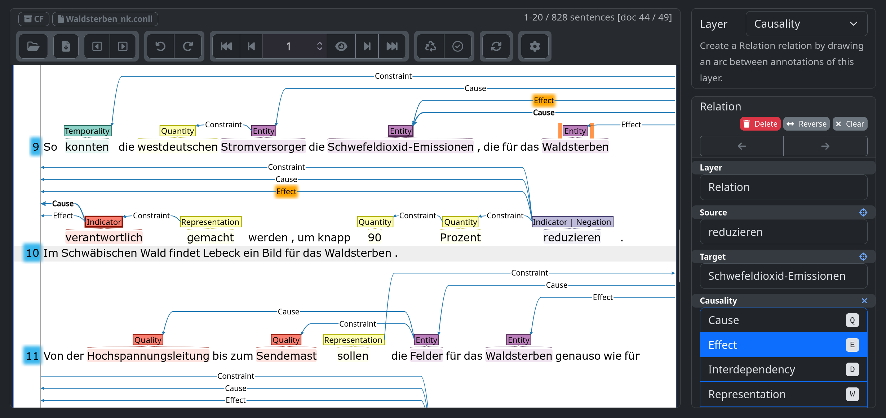

---
format:
  revealjs:
    theme: black
    slide-number: true
    progress: false
    preloadiframes: true
    view-distance: 99
    title-slide: false
    chalkboard: false
    mermaid:
      theme: dark
    logo: resources/tuda_logo.png
    math: mathjax
callout-appearance: minimal
editor:
  render-on-save: true
---

## Kausalsemantik ($S_C$) {.smaller}
Patrick Johnson


<hr></hr>
:::: {.columns}

::: {.column width="55%"}
> *Landwirtschaft~c~ und Pestizide~c~ [**verursachen**]{style="color:#87CEEB;"} Bienensterben~e~*.  
 
> *Bienensterben~c~ [**bedroht**]{style="color:#FF7F7F;"} Landwirtschaft~e~*.

<hr></hr>

| [Cause]{.underline .smallcaps} | [Effect]{.underline .smallcaps} | [Influence]{.underline .smallcaps}
| :--- | :--- | :--- |
| *Landwirtschaft* | *Bienensterben* | [0,5]{style="color:#87CEEB;"} |
| *Pestizide* | *Bienensterben* | [0,5]{style="color:#87CEEB;"} |
| *Bienensterben* | *Landwirtschaft* | [-1]{style="color:#FF7F7F;"} |

:::

::: {.column width="0%"}

:::

::: {.column width="45%"}

<br>

```{dot}
//| fig-width: 4.25
//| fig-height: 3.25
digraph G {
  bgcolor="transparent";
  node [shape=plaintext, fontcolor=white];
  edge [color=white, fontcolor=white];
  L [label="Landwirtschaft"];
  P [label="Pestizide"];
  B [label="Bienensterben"];
  L -> B [label="0,5    ", fontcolor="#87CEEB"];
  P -> B [label="0,5", fontcolor="#87CEEB"];
  B -> L [label="-1", fontcolor="#FF7F7F"];
}
```
:::
::::
 
::: {.notes}
Vielen lieben dank für die Vorstellung. Ich freue mich, heute hier vortragen zu dürfen und einen methodisch-priorisierten Einblick in meinem Disputationsvortrag zu geben, den ich am 24.06 an der TU Darmstadt in der Vollversion vortragen werde.

Ich werde die nächsten 20 Minuten darauf verwenden, ein Framework zur Extraktion und Projektion sprachlicher Kausalattribution – genannt Kausalsemantik – und dessen Anwendung zur Analyse von Verantwortungszuschreibungen im deutschsprachigen Umweltdiskurs vorzustellen. 

Auf der Titelfolie sehen wir bereits das Eingangs- und das Ausgangsformat der Kausalsemantik: Wir beginnen mit einer variablen Anzahl sprachlicher Zeichen (link oben) und überführen sie ein strukturiertes Format – einen Attributionalen Kausalgraphen (rechte Seite) –, der sowohl der Häufigkeit als auch der Richtung und Intesität einer beliebigen Menge an Kausalzuschreibungen Rechnung trägt.

Da die Kausalsemantik konzeptionell sprach- und domänenunabhängig ist, möchte ich mit der Erörterung einer inhaltlichen Herausforderung beginnen, die ich als Anwendungsfall zur Demonstration der Kausalsemantik nutze.
:::

:::: footer
&nbsp;&nbsp;causalsemantics.com/pres/dd
::::

<!-- slide -->
## UMWELT & VERANTWORTUNG {.smaller}

- Umweltprobleme **diskursiv** definiert und verhandelt (Hannigan 2014)
- Diskursive **Salienz** (Häufigkeit) korreliert mit politischer Priorität (Downs 1972)
- **Problemwahrnehmung** reziprok zu zeitlicher / räumlicher Distanz (Giddens 2009) <br> — „**slow violence**“ (Nixon 2011)
- **Kausaltyp** $\to$ Interventionsplausibilität (Fischer 2003)
  - *technisch* $\to$ technische Lösung
  - *strukturell* $\to$ Systemtransformation 

<hr>

:::: {.columns}

::: {.column width="100%"}
| [Ursachentyp]{.underline} | [Konsequenz]{.underline} |
| :--- | :--- |
| **Natürlich/Mechanisch** | Entlastet menschliche Verantwortung |
| **Intentional** | Forderungen nach Regulierung und Haftung |
| **Polykausal** | Verantwortungsdiffusion (Iyengar 1991) |

:::

::: {.column width="0%"}

:::

::: {.column width="0%"}

:::
::::

::: {.notes}
Spezifisch geht es mir um Umwelt und Verantwortung – die Attribution und Aushandlung von Handlungsdruck, der aus Umweltentwicklungen mit negativen Auswirkungen für gegenwärtige und zukünftige Lebewesen abgeleitet wird. Wenn man von 'Umweltproblemen' spricht, handelt es sich weniger um eine Bestandsaufnahme als um eine Forderung nach Verbesserung.

Je häufiger von einem Problem gesprochen wird, desto politisch salienter wird es – Downs spricht von einem Aufmerksamkeitszyklus. Giddens ergänzt eine räumliche und zeitliche Komponente: Ferne oder langsame Entwicklungen werden als weniger dringlich wahrgenommen. 

Nixon bezeichnet das als slow violence – strukturelle Krisen evozieren weniger Handlungsdruck als akute Katastrophen.

Fischer beschreibt das Verhältnis zwischen Kausaltypen und (politischen) Intervention: Technische Ursachen motivieren technische Lösungen, strukturelle motivieren Systemtransformationen.

In Stones Ursachentypologie entlasten natürliche Ursachen menschliche Akteure, während intentionale Ursachen Regulierungs- und Haftungsansprüche begründen. Ein dritter Kausaltyp ist für die Kausalsemantik besonders relevant: Polykausale Rahmungen diffundieren Verantwortung und vermengen Zuständigkeiten. Die Unterscheidung zwischen Mono- und Polykausalität ist damit nicht nur linguistisch, sondern politisch relevant.
:::


<!-- slide -->
## KAUSALINFERENZ {.smaller}

| [Paradigmenwechsel]{.underline} | [Autor(en)]{.underline} | [Für]{.underline} $S_C$ |
| :--- | :--- | :--- |
| Ontologisch<br>$\to$ epistemisch | Aristoteles<br>$\to$ Hume <span style="font-size: 0.6em;">(1739)</span> | Regularität als Annäherung |
| Regularität<br>$\to$ Polykausaliät | Mill <span style="font-size: 0.6em;">(1843)</span><br> $\to$ Mackie <span style="font-size: 0.6em;">(1965)</span> | INUS<br> $\to$ **Poly / Prio / Mono** |
| Beobachtung<br>$\to$ Kontrafaktik | Lewis <span style="font-size: 0.6em;">(1973)</span> | Kausalität als hypothetischer Vergleich |
| Korrelation<br>$\to$ Intervention | Pearl <span style="font-size: 0.6em;">(2000)</span> | $P(Y|X) \neq P(Y|\text{do}(X))$ |
| Typ-Kausalität<br>$\to$ Schuld | Halpern <span style="font-size: 0.6em;">(2016)</span> | Grad der Beteiligung<br> $\to$ $I \in [-1, 1]$ |

<hr></hr>

:::: {.columns}
::: {.column width="22%"}
**Priorität**  
<span style="font-size: 0.75em; opacity: 0.75;">$A$ zeitlich vor $B$</span>
:::
::: {.column width="4%"}
:::
::: {.column width="22%"}
**Hinlänglichkeit**  
<span style="font-size: 0.75em; opacity: 0.75;">$A$ genügt für $B$</span>
:::
::: {.column width="4%"}
:::
::: {.column width="22%"}
**Notwendigkeit**  
<span style="font-size: 0.75em; opacity: 0.75;">kein $B$ ohne $A$</span>
:::
::: {.column width="4%"}
:::
::: {.column width="22%"}
**Beitrag**  
<span style="font-size: 0.75em; opacity: 0.75;">Anteil von $A$ an $B$</span>
:::
::::

::: {.notes}
Kausalattributionen sind jedoch selbst das Ergebnis eines – kollektiven oder individuell mentalen – Aushandlungsprozesses. Mehr als 2000 Jahre westlicher Philosophie zielen darauf ab, das Verhältnis zwischen einer Sache und einer unendlichen Menge möglicher Ursachen zu klären.

Aristoteles' ontologische Wirkursache (causa efficiens) wird bei Hume durch beobachtete Abfolgen ersetzt. Mill leitet daraus induktive Schlussregeln ab: U.a. Die Methode der Differenz, in der sich zwei Situationen nur durch die vermutete Ursache unterscheiden dürfen.

Während eine Ursache bei Mackie's INUS-Prinzip nicht hinreichend, aber notwendiger Teil einer hinreichenden Konstellation ist, beschreibt Lewis Kausalität als kontrafaktischen Vergleich: 'Wäre X nicht eingetreten, wäre Y ebenfalls nicht passiert.' Pearl verweist darauf, dass die konditionale Wahrscheinlichkeit von Y im Falle X nicht dasselbe ist, wie die konditionale Wahrscheinlichkeit von Y, wenn man bewusst X kontrolliert.

Halpern überträgt dieses Prinzip auf polykausale Konstellationen, indem er Schuld über Pivotalität quantifiziert: wie viele andere Faktoren müssten entfernt werden, damit diese Ursache allein ausreicht?

Die vier Bedingungen unten sind keine sechste Theorie, sondern das gemeinsame Substrat aller fünf: Was sich von Zeile zu Zeile ändert, ist nicht ob diese Bedingungen gelten – sondern wie sie formalisiert, gewichtet und auf Grenzfälle angewendet werden.
:::

<!-- slide -->
## KOGNITION & FRAMES {.smaller}

:::: {.columns}

::: {.column width="60%"}
### Mentale Repräsentation
- **Lakoff / Johnson** <span style="font-size: 0.6em;">(1980)</span>: *Causation is a Force* — Intensität × Richtung
- **Talmy** <span style="font-size: 0.6em;">(1988)</span>: Kraftdynamik
  - *zwingen* (Druck) · *verhindern* (Blockierung)
  - $\to$ [fördernd]{style="color:#87CEEB;"} / [hemmend]{style="color:#FF7F7F;"}

### Semantische Rollen
- **Fillmore** <span style="font-size: 0.6em;">(1968)</span>: [Agens]{.smallcaps} $\to$ [Instrument]{.smallcaps}  $\to$ [Patiens]{.smallcaps}
- **Zifonun** <span style="font-size: 0.6em;">(1997)</span>: [Verursacher]{.smallcaps} ($\supsetneq$ [Agens]{.smallcaps}) → abstrakte Kausalattributionen
- **Polenz** <span style="font-size: 0.6em;">(2008)</span>: Perspektivierung — Passiv defokussiert [Verursacher]{.smallcaps}

:::

::: {.column width="5%"}

:::

::: {.column width="35%"}
### Konnektoren & Modalität
- **Sweetser** <span style="font-size: 0.6em;">(1990)</span>
  - Inhalts- / epistemische / Sprechaktkausalität
  - $S_C$ → Inhaltskausalität
- **König** <span style="font-size: 0.6em;">(1991)</span>
  - Konzessiva (*obwohl*)
  - erwartete Relation bleibt aus

:::
::::

::: {.notes}
Während die logischen Theorien Kausalität formal definieren, beschreiben kognitions- und sprachwissenschaftliche Arbeiten, wie Kausalität mental repräsentiert und sprachlich kodiert wird.

Lakoff und Johnson zeigen, dass Kausalität als körperlich erfahrbare Kraft-Metapher verinnerlicht wird. Talmys Kraftdynamik überführt das in Verbklassen: Druck (zwingen), Blockierung (verhindern), Transfer (beitragen).

Fillmores Subjektivierungshierarchie beschreibt, warum 'Der Klimawandel verursacht X' grammatisch analog zu 'Menschen verursachen X' ist, indem ein AGENS durch das INSTRUMENT oder PATIENS ersetzt wird. Zifonun führt VERURSACHER als Überkategorie ein, das jenseits des AGENS auch abstrakte Entitäten erfasst. Polenz fügt hinzu, dass Passivierungen Verursacher systematisch defokussieren.

Schließlich beschreibt Sweetser eine Typologie kausaler Konnektoren, in der Inhaltskausalität die Attribution außersprachlicher Ursache-Wirkungs-Verhältnisse bezeichnet. König ergänzt wichtige Grenzfälle: Konzessiva markieren erwartete Kausalrelationen, die nicht eintreten.
:::


<!-- slide -->
## EXTRAKTION & PROJEKTION {.smaller}

:::: {.columns}

::: {.column width="45%"}
### Rehbein / Ruppenhofer (2017)
- Verb-zu Konstruktion
  - *X~C~ [führt]{.underline} [zu]{.underline} Y~E~*
- Transitive-kausative Konstruktion
  - *X~C~ [verursacht]{.underline} Y~E~*
- Präpositionale Konstruktion
  - *[Durch]{.underline} X~C~ [entsteht]{.underline} Y~E~*
:::

::: {.column width="10%"}

:::

::: {.column width="45%"}
### Dunietz et al. (2017)
- [FACILITATE]{style="color:#87CEEB;"} 'erleichtern'
  - *We are in serious economic trouble [because]{.underline} [of]{.underline} inadequate regulation.*
- [INHIBIT]{style="color:#FF7F7F;"} 'hemmen'
  - *The new regulations should [prevent]{.underline} future crises.*

### Wu et al. (2025)
- (Rain) -[:CAUSES]-> (Wetness)
:::
::::

<hr></hr>
Bestehende Systeme extrahieren **monokausale** Ursache-Wirkungs-Paare. 

$\to$ **Negation** & **Polykausalität** bleiben unerfasst.

::: {.notes}
Zur automatischen Extraktion von Kausalattributionen spannen Rehbein / Ruppenhofer das weiteste Netz, indem sie sich vor allem auf kompakte Konstruktionen (x verursacht y / x ist die Ursache von y / y durch x usw.) konzentrieren. 

Dunietz et al. unterscheiden (wie Talmy) zwischen fördernden und hemmenden Relationen. Schließlich extrahieren Wu et al. die extrahierten Attributionen in Subjekt-Prädikat-Objekt Tripel, die zu Causal-Knowledge Graphs aggregiert werden.

In der Summe finden liegen eine große Zahl bestehender Ansätze zur Extraktion und – zu einem geringeren Teil – der Projektion vor. Beide Stränge werden im Folgenden zur Kausalsemantik fusioniert, die darüber hinaus noch den Prinzipien der Polykausalität Rechnung trägt.
:::

<!-- slide -->
## INDIKATOREN {.smaller}
$\small (C = \text{Cause}; E = \text{Effect}; I = [-1, 1])$

<hr></hr>

:::: {.columns}

::: {.column width="45%"}
### Hemmend
#### Mono ([$\small -1$]{style="color:#FF7F7F;"})
- $C$ *stoppt* / *verhindert* / *gegen* $E$

<hr></hr>

#### Prio ([$\small -0{,}75$]{style="color:#FF7F7F;"})
- $C$ *ist die größte Bedrohung für* $E$

<hr></hr>

#### Poly ([$\small -0{,}5$]{style="color:#FF7F7F;"})
- $C$ *reduziert* / *mindert* $E$
:::

::: {.column width="5%"}

:::

::: {.column width="45%"}
### Fördernd
#### Mono ([$\small +1$]{style="color:#87CEEB;"})
- $C$ *ist* *der* *Grund* / *verantwortlich* *für* $E$

<hr></hr>

#### Prio ([$\small +0{,}75$]{style="color:#87CEEB;"})
- $C$ *ist der Hauptgrund für* $E$

<hr></hr>

#### Poly ([$\small +0{,}5$]{style="color:#87CEEB;"})
- $C$ *verstärkt* / *intensiviert* $E$

:::
::::

<hr>

$\pm =$  Polarität; $||I|| =$ Salienz


::: {.notes}
Der ausdrucksseitige Anker liegt in lexikalisch-definierten Indikatoren (u.a. *verursachen*, *verstärken*, *reduzieren*, *stoppen*). Indikatoren projizieren kausale Rollen (Cause, Effect) auf syntaktische Nachbarn.

Jeder Indikator lässt sich anhand der Dimensionen Polarität (hemmend/fördernd) und Salienz – als Maß der Exklusivität von Mono bis Poly – kategorisieren.

Aus der Kombination beider Dimensionen ergibt sich ein numerischer Wert, in dem Polarität das Vorzeichen – und Salienz (von 0 bis 1) den absoluten Wert darstellt. Diskrete Einheiten (Zeichenketten) werden dabei auf ein Ordinalzahlensystem projiziert, in dem monokausale hemmende Relationen (-1) maximal von monokausal fördernden Relationen (+1) entfernt sind.
:::

<!-- slide -->
## KONTEXTMARKER {.smaller}
$\small (C = \text{Cause}; E = \text{Effect}; I = [-1, 1])$

<hr></hr>

:::: {.columns}

::: {.column width="45%"}
#### Prio ($\small ||I|| = 0{,}75$)
- [*vor allem*]{.underline} $C$ *verursacht* $E$
- $C$ *ist [*maßgeblich*]{.underline} an* $E$ *beteiligt*

<hr></hr>

#### Poly ($\small ||I|| = 0{,}5$)
- [*Unter anderem*]{.underline} $C$ *verursacht* $E$
- [*Nicht nur*]{.underline} $C$ *verursacht* $E$
:::

::: {.column width="5%"}

:::

::: {.column width="45%"}
### Negation
#### Propositional ($\small I \cdot 0$)
- $C$ *ist* [*nicht*]{.underline} *der Grund* *für* $E$

<hr></hr>

#### Objektbasiert ($\small I \cdot$ [$-1$]{style="color:#FF7F7F;"})
- $C$ *verursacht die [*Vernichtung*]{.underline} von* $E$

:::
::::

<hr>

$\pm =$  Polarität; $||I|| =$ Salienz


::: {.notes}
Hinzu treten eine Reihe an Kontextmarkern: Priorisierungen wie 'vor allem', sodann sie sich auf Ursachen beziehen, setzen, den absoluten Einfluss auf 0,75. Äquivalent verhalten sich polykausale Marker wie 'unter anderem', wobei der projizierte Einfluss auf 0,5 fällt.

Negation erscheint in zwei unterschiedliche Formen. Propositional – bspw. 'nicht' oder 'keine' in 'keine Schuld' – neutralisieren sie den Einfluss zu 0. Objektbasierte Negationen 'Schwund'/'Verlust/Vernichtung' invertieren die Richtung.

Daraus folgt ein mehrstufiger Algorithmus, in dem sowohl lexikalische (verursachen vs. stoppen) als auch morphologische Aspekte (Ursache vs. Hauptursache) einen Einflusswert bestimmen, der durch syntaktische Kontextmarker weiter modifiziert wird.
:::


<!-- slide -->
## DATEN {.smaller}

:::: {.columns}

::: {.column width="50%"}
<div style="text-align: center;margin-bottom: -10px;margin-top: 40px;">
<span style="font-size: 1em;">$\textit{WABI}$</span>
</div>

```{python}
import pandas as pd
import plotly.express as px
import os

# Path to the data file
file_path = 'dat/wabi_yearly.dat'

try:
    # Read the data from the .dat file
    df = pd.read_csv(file_path, sep=r'\s+', engine='python')

    # Convert the DataFrame from wide to long format for Plotly
    df_long = df.melt(id_vars=['year'], 
                      var_name='term', 
                      value_name='mentions')
    df_long['term'] = df_long['term'].str.capitalize()
    # Create the Plotly line chart
    fig = px.line(df_long, 
                  x='year', 
                  y='mentions', 
                  color='term',
                  labels={"year": "", "mentions": "", "term": ""},
                  color_discrete_sequence=px.colors.qualitative.T10,
                  title="")

    # Update the layout for a dark, transparent theme
    fig.update_layout(
        plot_bgcolor="rgba(0,0,0,0)",
        paper_bgcolor="rgba(0,0,0,0)",
        template="plotly_dark",
        xaxis=dict(
            showgrid=True,
            gridcolor="rgba(200, 200, 200, 0.01)",
            tickmode="linear",
            tick0=df['year'].min(),
            dtick=2,
            tickangle=45
        ),
        yaxis=dict(
            showgrid=True,
            gridcolor="rgba(200, 200, 200, 0.1)"
        ),
        legend=dict(
            orientation="h",
            yanchor="bottom",
            y=0.95,
            xanchor="right",
            x=0.85,
        ),
        showlegend=False,
        margin=dict(l=0, t=15),
        width=515,
        height=350
    )

    # Show the plot
    fig.show()

except FileNotFoundError:
    print(f"Error: The file '{file_path}' was not found.")
except Exception as e:
    print(f"An error occurred: {e}")

```
:::

::: {.column width="6%"}
:::

::: {.column width="40%"}
| **Form** | **#** | **\%** |
| :--- | :---: | :---: |
| *Aussterben* | 3812 | 35% |
| <span style="color: #72b6b1;">—</span> ***Waldsterben*** | 1837 | 15% |
| <span style="color: #4c78a8;">—</span> ***Artensterben*** | 1562 | 13% |
| *Massensterben* | 692 | 6% |
| <span style="color: #f58518;">—</span> ***Bienensterben*** | 549 | 4% |
| <span style="color: #e45756;">—</span> ***Insektensterben*** | 490 | 4% |
| *Fischsterben* | 450 | 4% |
| *Absterben* | 373 | 3% |
: {tbl-colwidths="[90,10,10]"}
:::
::::

<hr>

$$ \small | K_U | \approx ~2.2 \cdot 10^7,\quad K_U \subsetneq (\text{FAZ} \cup \text{Spiegel} \cup \text{Bild} \cup \text{taz} \cup \text{ZEIT} \cup \text{SZ} \cup \text{Plenar}_{\text{Bundestag}}) $$

::: {.notes}
Sowohl die 642 verschiedenen Indikatorformen als auch Kontextmarker-Kategorien wurden anhand eines Annotationskorpus mit rund 4000 Sätzen identifiziert, die mindestens eins der vier Lemmata 'Waldsterben', 'Artensterben', 'Bienensterben' oder 'Insektensterben' (im Folgenden 'WABI') enthalten. 

Mit diesem Annotationskorpus, das selbst ein Subset eines aus 22 Millionen Sätzen bestehenden Umweltkorpus (KU) aus Zeitungstexten und Plenarprotokollen des dt. Bundestags darstellt, wird ein Zeitraum von 1990-2020 erfasst. 

Die Analyse der WABI zielt dabei darauf ab, sowohl begriffsinterne Dynamiken als auch Gemeinsamkeiten und Divergenzen zwischen den Begriffen mithilfe der Kausalsemantik zu offenbaren.
:::

<!-- slide -->
## EXZERPTE I {.smaller}
### Fördernd
- ***Fipronil** wird für das **Bienensterben** [mitverantwortlich]{.underline style="color:#87CEEB;"} gemacht.*  
<span style="font-size: 0.75em;">[[T13_JUL_02539]{.smallcaps}]</span>

$$
(\text{Fipronil}; \text{Bienensterben}; 0,5)
$$

<hr>

### Hemmend
- *Die grüne **Landwirtschaftsministerin** hat das **Waldsterben** [gestoppt]{.underline style="color:#FF7F7F;"}.* 
<span style="font-size: 0.75em;">[[T03_JUL_34309]{.smallcaps}]</span>

$$
(\text{Landwirtschaftsministerin}; \text{Waldsterben}; -1)
$$

::: {.notes}
Anhand der Indikatoren ('mitverantwortlich' oben, 'gestoppt' unten) werden Relationstupeln konstruiert, um Ursachen (hier 'Fipronil' und 'Landwirtschaftsministerin') und Wirkungen der einzelnen WABI inklusive instanzspezifischer Einflusswerte zu extrahieren.

Während 'mitverantwortlich' (polykausal fördernd) einen Einfluss von 0,5 projiziert, wird 'gestoppt' als monokausal hemmend (-1) gelesen.
:::

<!-- slide -->
## EXZERPTE II {.smaller}
### Verkettung
- *Gut, dass die **EU** [wegen]{.underline style="color:#87CEEB;"} des **Bienensterbens** endlich **Neonicotinoide** [verbieten]{.underline style="color:#FF7F7F;"} will.*
<span style="font-size: 0.75em;">[[U18_MAI_00199]{.smallcaps}]</span>

$$
(\text{Neonicotinoide}; \text{Bienensterben}; 1), (\text{EU}; \text{Neonicotinoide}; -1)
$$

<hr>

### Koordination & Objektnegation
- *Neben dem **Insektensterben** [leiden]{.underline style="color:#FF7F7F;"} diese **Arten** auch unter einem [Mangel]{style="color:#FF7F7F;"} an **Brutplätzen**.* 
<span style="font-size: 0.75em;">[[U18_JUL_00207-57]{.smallcaps}]</span>

$$
(\text{Insektensterben}; \text{Arten}; -0{,}5), (\text{Brutplätze}; \text{Arten}; 0{,}5)
$$

::: {.notes}
Dieses 'Einflussbudget' gilt pro Indikator. Mehrere Indikatoren mit unterschiedlichen (Cause, Effect) Permutationen innerhalb eines Satzes werden bewusst nicht übergangen, sondern stellen – beispielsweise im Rahmen einer Verkettung (oben) – selbst einen satzinternen attributionalen Kausalgraphen dar.

In eine ähnliche Kerbe schlagen Koordinationen: Im unteren Auszug erscheint 'Insektensterben' nicht als einzige explizite Ursache, sondern in einem polykausalen Verbund mit einem 'Mangel an Brutplätzen'. Der indikatorspezifische Einfluss von 'leiden' (-1) verteilt sich dabei auf beide Ursachen (jeweils -0.5).

Im vorliegenden Fall wird 'Mangel' darüber hinaus als objektbasierte Negation gelesen: Das Vorzeichen (Polarität) von 'Brutplätzen' wird von -0.5 zu 0.5 invertiert. In der Summe ergibt sich ein positives Verhältnis zwischen Brutplätzen und Arten. 
:::

<!-- slide -->
## Waldsterben (Ursachen) {.smaller}
<hr>

:::: {.columns}
::: {.column width="45%"}
### 1990-2004

| [Cause]{.smallcaps .underline} | [n]{.underline} | [∅ I]{.underline} | [% I]{.underline} |
| :----------------------------- | --------------: | ----------------: | -------------------: |
| *Saurer Regen*                   | 9               | 0,87              | 6,0                  |
| *Stickoxid*                     | 10              | 0,56              | 4,1                 |
| *Luftverschmutzung*             | 5               | 0,90               | 3,4                 |
| ***Autos***                        | 6               | 0,69              | 3,1                 |
| *Schwefeldioxid*                 | 5               | 0,78              | 2,9                 |
| *Ozon*                          | 6               | 0,54              | 2,5                 |
| ***Verkehr***                        | 4               | 0,75              | 2,3                 |
:::

::: {.column width="5%"}
:::

::: {.column width="50%"}
### 2019-2020
| [Cause]{.smallcaps .underline} | [n]{.underline} | [∅ I]{.underline} | [% I]{.underline} |
| :----------------------------- | --------------: | ----------------: | ----------------: |
| ***Klimawandel***                   |               8 |              0,71 |              27,5 |
| *Luftverschmutzung*             |               2 |              1,00 |              11,6 |
| *Trockenheit*                    |               2 |              1,00 |               5,8 |
| *Hirsch*                        |               1 |              1,00 |               5,8 |
| *Glob. Erwärmung*               |               1 |              1,00 |               5,8 |
| *Saurer Regen*                   |               4 |              0,25 |               5,8 |
| *Dürre *                         |               1 |              1,00 |               5,8 |
:::
::::

<hr>

<div>
<span style="font-size: 0.75em;">📄 Johnson, P. (2026). *Waldsterben 2.0 -- Climate change as an attributed cause of forest diebacks*. In: Landscapes in Language, Society and Cognition (Interdisciplinary Linguistics). Berlin/Boston: De Gruyter Mouton. (i. Dr.)</span>
</div>

::: {.notes}
Die Tupeln variabler Konstellationen (hier Ursachen von Waldsterben in zwei Zeiträumen) werden schließlich aggregiert und normalisiert. Daraus ergibt sich neben der absoluten kausalen Okkurrenz (n, zweite Spalte), ein durchschnittlicher Instanzeinfluss (dritte Spalte) und der prozentuale Anteil am Gesamteinfluss (vierte Spalte).

Im vorliegenden Fall wird die Verschiebung der attribuierten Ursachen ablesbar, indem ein Fokus auf Verkehr, Emissionen und Sauren Regen (links) der Hervorhebung klimatischer Faktoren auf der rechten Seite weicht. Anthropogene Einflüsse, die insbesondere bei Autos oder Verkehr noch deutlich expliziter ausfallen, rücken trotz ihres etablierten Beitrags zum Klimawandel somit zunehmend in den Hintergrund.
:::

<!-- slide -->
## Bienensterben (Wirkungen) {.smaller}
<hr>

:::: {.columns}
::: {.column width="45%"}
### Kategorien
| [Effect]{.smallcaps .underline} | [n]{.underline} | [∅ I]{.underline} | [% I]{.underline} |
| :----------------------------- | --------------: | ----------------: | -----------------: |
| **[Landwirtschaft]{.smallcaps}**   | **15**              | **-0,8**              | **-48,4**             |
| [Politik]{.smallcaps}          | 2               | -1,00             | -12,9             |
| [Biota]{.smallcaps}            | 4               | -1,00             | -12,9             |
| [Diskurs]{.smallcaps}          | 2               | +0,75             | 9,7               |
| [Abstrakt]{.smallcaps}         | 2               | +0,75             | 9,7               |
| [Emission]{.smallcaps}         | 1               | +0,50             | 3,2               |
| [Mensch]{.smallcaps}           | 1               | +0,50             | 3,2               |
:::

::: {.column width="5%"}
:::

::: {.column width="50%"}
### Verbatim (Top-7)

| [Effect]{.smallcaps .underline} | [n]{.underline} | [Kategorie]{.underline}      |
| :----------------------------- | --------------: | ---------------------------- |
| ***Ernte***                          | 2               | **[Landwirtschaft]{.smallcaps}** |
| *Bienenkrankheiten*              | 1               | [Biota]{.smallcaps}          |
| *Bundesamt*                      | 1               | [Politik]{.smallcaps}        |
| ***Erdbeer-Bauern***                 | 1               | **[Landwirtschaft]{.smallcaps}** |
| *Naturhaushalt*                  | 1               | [Biota]{.smallcaps}          |
| ***Landwirtschaft***                 | 1               | **[Landwirtschaft]{.smallcaps}** |
| *Kolonien*                       | 1               | [Biota]{.smallcaps}          |
:::
::::

<hr>

<div>
<span style="font-size: 0.75em;">1990-2013, global: ∅ I = 0,82 über 25 Entitäten (n=27)</span>
</div>

::: {.notes}
Ebenso lassen sich Wirkungen gesondert analysieren, wobei ihre absolute Fallzahlen grundsätzlich geringer und versprengter sind. 

Aus Gründen der Vergleichbarkeit wurden verbatime Entitäten (bspw. *Ernte*, *Erdbeer-Bauern* auf der rechten Seite) zu insgesamt 12 Kategorien (bspw. Landwirtschaft, linke Seite) aggregiert, von denen hier sieben sehen sind.
:::

<!-- slide -->
## Bienensterben (Wirkungen) {.smaller}
<hr>

:::: {.columns}
::: {.column width="45%"}
### 1990-2013

| [Effect]{.smallcaps .underline} | [n]{.underline} | [∅ I]{.underline} | [% I]{.underline} |
| :----------------------------- | --------------: | ----------------: | -----------------: |
| **[Landwirtschaft]{.smallcaps}**   | **15**              | **-0,8**              | **-48,4**             |
| [Politik]{.smallcaps}          | 2               | -1,00             | -12,9             |
| **[Biota]{.smallcaps}**            | **4**               | **-1,00**             | **-12,9**             |
| [Diskurs]{.smallcaps}          | 2               | +0,75             | 9,7               |
| [Abstrakt]{.smallcaps}         | 2               | +0,75             | 9,7               |
| [Emission]{.smallcaps}         | 1               | +0,50             | 3,2               |
| [Mensch]{.smallcaps}           | 1               | +0,50             | 3,2               |
:::

::: {.column width="5%"}
:::

::: {.column width="50%"}
### 2014-2020
| [Effect]{.smallcaps .underline} | [n]{.underline} | [∅ I]{.underline} | [% I]{.underline} |
| :------------------------------ | --------------: | ----------------: | ----------------: |
| **[Biota]{.smallcaps}**             |               **8** |             **-1,00** |             **-48,0** |
| [Diskurs]{.smallcaps}           |               2 |             -1,00 |              20,0 |
| **[Landwirtschaft]{.smallcaps}**    |               **4** |             **-1,00** |              **-8,0** |
| [Mensch]{.smallcaps}            |               2 |             +0,75 |              -8,0 |
| [Politik]{.smallcaps}           |               2 |             +0,75 |              -8,0 |
| [Abstrakt]{.smallcaps}          |               1 |             +0,50 |               4,0 |
| [Emission]{.smallcaps}          |               1 |             +0,50 |               4,0 |
:::
::::

<hr>

::: {.notes}
Im Falle Bienensterben wird dabei eine drastische Verschiebung der Wirkungen ersichtlich. Zunächst liegt der Fokus auf bedrohten Imkern und Ernteausfällen durch Bestäubungsverluste (linke Seite). 

In der zweiten Phase dominieren dagegen vor allem Spezifikationen mittel- oder unmittelbar bedrohter Arten (Biota), indem unter anderem auch Wildbienen verstärkt Aufmerksamkeit erfahren.
:::

<!-- slide -->
## Artensterben (Interventionen) {.smaller}
<hr>

:::: {.columns}
::: {.column width="45%"}
### 1990-2009

| [Cause]{.smallcaps .underline} | [n]{.underline} | [∅ I]{.underline} | [% I]{.underline} |
| :----------------------------- | --------------: | ----------------: | ----------------: |
| [Politik]{.smallcaps}          |              29 |             -0,88 |             -43,5 |
| **[Mensch]{.smallcaps}**           |              **15** |             **-0,86** |             **-22,2** |
| **[Abstrakt]{.smallcaps}**        |               **9** |             **-0,93** |             **-14,3** |
| [Biota]{.smallcaps}            |               9 |             -0,56 |              -8,5 |
| [Wirtschaft]{.smallcaps}       |               3 |             -1,00 |              -5,1 |
| [Naturschutz]{.smallcaps}      |               2 |             -1,00 |              -3,4 |
| [Diskurs]{.smallcaps}          |               1 |             -1,00 |              -1,7 |
:::

::: {.column width="5%"}
:::

::: {.column width="50%"}
### 2019-2020
| [Cause]{.smallcaps .underline} | [n]{.underline} | [∅ I]{.underline} | [% I]{.underline} |
| :----------------------------- | --------------: | ----------------: | ----------------: |
| [Politik]{.smallcaps}          |              25 |             -0,92 |             -35,2 |
| **[Abstrakt]{.smallcaps}**         |              **23** |             **-0,82** |             **-27,6** |
| [Naturschutz]{.smallcaps}      |               6 |             -1,00 |              -9,2 |
| [Diskurs]{.smallcaps}          |               6 |             -0,88 |              -8,4 |
| **[Mensch]{.smallcaps}**           |               **4** |             **-0,88** |              **-5,4** |
| [Wirtschaft]{.smallcaps}       |               3 |             -0,88 |              -5,4 |
| [Landwirtschaft]{.smallcaps}   |               2 |             -1,00 |              -4,6 |
:::
::::

<hr>

<div>
</div>

::: {.notes}
Auf der Seite der Interventionen (hemmende Ursachen) liegt eine begriffsübergreifende Tendenz zur Symbolisierung bzw. Abstrahierung vor. 

Im Falle Artensterben verschieben sich die Interventen von generisch-menschlichen Einheiten zunehmend in Richtung der Kategorie ABSTRAKT – die vor allem in Form von Pronomina wie 'jemand' oder 'etwas tun' erscheint
:::


<!-- slide -->
## C-BERT {.smaller}
:::: {.columns}
::: {.column width="75%"}
| [Token]{.underline} | [Classification]{.underline} | [Confidence]{.underline} |
| :--- | :--- | :--- |
| *Die* | O | 0,57 |
| *Bundesregierung* | ENTITY | 0,59 |
| *stoppt* | INDICATOR | 0,54 |
| *das* | O | 0,30 |
| *Waldsterben* | ENTITY | 0,65 |
:::

::: {.column width="0%"}
:::

::: {.column width="25%"}
<div style="text-align: right;">
<span style="font-size: 0.75em;">🤗 pdjohn/C-EBERT-610m</span>
</div>
<div style="text-align: right;">
<span style="font-size: 0.75em;"> padjohn/cbert</span>
</div>

:::
::::

<br>

| [Indicator]{.underline} | [Entity]{.underline} | [Relation]{.underline} | [Confidence]{.underline} |
| :--- | :--- | :--- | :--- |
| *stoppt* | *Bundesregierung* | MONO_POS_CAUSE | 0,99 |
| *stoppt* | *Waldsterben* | MONO_[NEG]{style="color:#FF7F7F;"}_EFFECT | 0,88 |

<hr></hr>
<div>
<span style="font-size: 0.75em;"> 📄 Johnson P. (2026). *C-BERT: Factorized Causal Relation Extraction*.
Doi: 10.26083/tuda-7797. (Preprint)
</div>

::: {.notes}
Jenseits der diachronen Detailanalyse dienen die annotierten WABI-Sätze auch als Daten zum Training eines eigens entwickelten Multi-Task Transformers, der sprachliche Muster mittels modifizierter, numerischer Gewichtsmatrizen verinnerlicht.

In einem zweistufigen Verfahren klassifiziert C-BERT sowohl Spannen (Token, oben) als auch Relationen (unten). Letztere werden als Ergebnis maschineller 'Annotation' ebenso in (Cause, Effect, Influence) Tupeln – in diesem Fall (Bundesregierung, Waldsterben, -1) – überführt.  
:::

<!-- slide -->

## ATTRIBUTIONAL CAUSAL GRAPH {.smaller}
<!--  -->
```{python}
import pandas as pd
import plotly.graph_objects as go

IN_CACHE = 'dat/acg'
MIN_INF = 3

nodes = pd.read_csv(f'{IN_CACHE}/network_nodes_render.csv').fillna('')
edges = pd.read_csv(f'{IN_CACHE}/network_edges_render.csv')

edge_traces = [
    go.Scatter(
        x=[row.x0, row.x1, None], y=[row.y0, row.y1, None],
        line=dict(width=abs(row.influence) / 3, color=row.color),
        hoverinfo='none', mode='lines'
    )
    for _, row in edges.iterrows()
]

node_trace = go.Scatter(
    x=nodes['x'], y=nodes['y'],
    text=nodes['label'],
    mode='markers+text',
    marker=dict(
        size=nodes['size'],
        colorscale='RdBu',
        color=nodes['balance'],
        line_width=5,
    ),
    textfont=dict(
        color=nodes['label_color'].tolist(),
        size=(nodes['size'] / 2.5).tolist(),
        shadow=nodes['label_shadow'].tolist(),
    ),
    hovertext=nodes['Id'],
    hoverinfo='text'
)

fig = go.Figure(
    data=edge_traces + [node_trace],
    layout=go.Layout(
        title=f'',
        showlegend=False, hovermode='closest',
        margin=dict(b=0, l=0, r=0, t=40),
        width=875, height=525,
        xaxis=dict(showgrid=False, zeroline=False, showticklabels=False),
        yaxis=dict(showgrid=False, zeroline=False, showticklabels=False),
        plot_bgcolor='rgba(0,0,0,0)',
        paper_bgcolor='rgba(0,0,0,0)',
        template='plotly_dark'
    )
)
fig.update_layout(margin=dict(t=0,b=25))

fig.show()

```

:::: {.columns}
::: {.column width="28%"}
- 360.000 Entitäten
- 1,6 Mio. Relationen
:::

::: {.column width="10%"}
:::

::: {.column width="54%"}

```{.cypher filename="Cypher Query (Neo4j)"}
// Wirkungen von Klimawandel (unmittelbar)
MATCH (c:Klimawandel)-[r:influence]->(e)
RETURN c, e, i
```

:::
::::

::: {.notes}
Auf die 22 Millionen Sätze des Umweltkorpus angewandt, ergibt sich ein Attributionaler Kausalgraph (ACG) bestehend aus 360.000 Entitäten und 1.6 Millionen Relationen, von denen hier 212 Entitäten und 690 Relationen zu sehen sind.  

Neben der Visualisierung lässt sich der ACG – beispielsweise eingebettet in die Graphdatenbank Neo4j – nach Belieben abfragen, um unmittelbare (und wahlweise mittelbare) Wirkungen von Klimawandel (unten rechts) auszugeben.
:::

## METRIKEN {.smaller}

### Agency ($\to$)
- Absolute Summe **aus**gehender Einflüsse
- *Mensch* ($\small 16.149$) $>$ *Klimawandel* ($\small 10.418$) $>$ *Waldsterben* ($\small 164$) $>$ *Insektensterben* ($\small 41$)

### Sensitivity ($\leftarrow$) 
- Absolute Summe **ein**gehender Einflüsse
- *Mensch* ($\small 22.060$) $>$ *Strom* ($\small 10.758$) $>$ *Artensterben* ($\small 421$) $>$ *Insektensterben* ($\small 129$)

### Discourse Balance ($\overset{\pm}{\leftarrow}$) 
- **Verhältnis** zwischen fördernden und hemmenden **eingehenden** Einflüssen
- *Strom* ($\small 6.565$) $>$ *Waldsterben* ($\small 142$) $>$ *Insektensterben* ($\small 22$) $>$ *Klimawandel* ($\small -3.026$)

::: {.notes}
Zur Makroanalyse wurden eine Reihe an Metriken entwickelt, die beispielsweise den absoluten ausgehenden (Agency) oder eingehenden Einfluss (Sensitivity) einer Entität messen. 

Dabei zeigt sich, das die WABI zwar rekurrente Einheiten des Umweltdiskurses darstellen, jedoch weitaus weniger aktiv sind als beispielsweise 'Mensch', 'Klimawandel' oder 'Strom'. 

Discourse Balance, die das Verhältnis zwischen fördernden und hemmenden eingehenden Einflüssen beschreibt, charakterisiert die WABI weiter: Der Fokus liegt bei allen vier Begriffen auf fördernden Ursachen, wobei Insektensterben noch die höchste Rate an hemmenden gegenüber fördernden Ursachen aufweist. 

:::

<!-- slide -->
## KAUSALVEKTOREN {.smaller}
```{python}
import pandas as pd
import plotly.graph_objects as go
import plotly

# Your data
data = {
    'Cause': ['Mensch', 'Klimawandel', 'Artensterben', 'Landwirtschaft', 'Politik'],
    'Mensch': [0, -34.50, -2.00, 36.25, 6.5],
    'Klimawandel': [343.75, 0, 0.75, 25.75, -45.5],
    'Artensterben': [30.75, 3.25, 0, 10.75, -3],
    'Landwirtschaft': [12.75, -28.00, 0, 0, 8.5],
    'Politik': [30.75, 5, 0, 1.75, 0]
}

def get_transparent_rdbu(min_alpha=0.1):
    colors = plotly.colors.diverging.RdBu
    n = len(colors)
    mid = (n - 1) / 2
    scale = []
    for i, rgb in enumerate(colors):
        # Calculate opacity: lower in the middle, higher at the ends
        dist_from_center = abs(i - mid) / mid
        alpha = min_alpha + (1 - min_alpha) * dist_from_center
        
        rgba = rgb.replace('rgb', 'rgba').replace(')', f', {alpha:.2f})')
        scale.append([i/(n-1), rgba])
    return scale

custom_rdbu = get_transparent_rdbu(min_alpha=0.9)

df = pd.DataFrame(data)
df = df.set_index('Cause')

# Create heatmap
fig = go.Figure(data=go.Heatmap(
    z=df.values,
    x=df.columns,
    y=df.index,
    colorscale=custom_rdbu,  # Red-Blue reversed (red for positive, blue for negative)
    zmid=0,
    zmax=20,
    zmin=-20,
    xgap=5,
    ygap=5,
    text=df.values,
    texttemplate='%{text:.2f}',
    textfont={"size": 12},
    colorbar=dict(title="Influence"),
    hovertemplate='Cause: %{y}<br>Effect: %{x}<br>Value: %{z:.2f}<extra></extra>'
))

fig.update_layout(
    title="",
    separators=',.',
    xaxis_title="<b>Effect</b>",
    yaxis_title="<b>Cause</b>",
    plot_bgcolor="rgba(0,0,0,0)",
    paper_bgcolor="rgba(0,0,0,0)",
    # width=875,
    height=315,
    template="plotly_dark",
    xaxis=dict(
        # tickangle=-45,
        linewidth=0,
        side ="top",
        showgrid=False

    ),
    yaxis=dict(showgrid=False, visible=True,autorange='reversed')
)

fig.add_shape(
    type="rect",
    x0=0.51, y0=-0.49, x1=1.49, y1=0.47, # Cell boundaries
    line=dict(color="Orange", width=3),
)

fig.add_shape(
    type="rect",
    x0=-0.49, y0=0.51, x1=0.49, y1=1.47, # Cell boundaries
    line=dict(color="Orange", width=3),
)

fig.update_yaxes(ticklabelstandoff=10)
fig.update_xaxes(ticklabelstandoff=10)
fig.update_yaxes(title_standoff=30)

fig.show()
```
<hr></hr>

:::: {.columns}
::: {.column width="100%"}
$$\small \overrightarrow{v}_{\text{Mensch}_C} = [\text{Mensch}, \text{Klimawandel}, \text{Artensterben}, ... ] = [0; 343{,}75; 30{,}75; ... ]$$
$$\small \overrightarrow{v}_{\text{Mensch}_E} = [\text{Mensch}, \text{Klimawandel}, \text{Artensterben}, ... ] = [0; -34{,}5; -2; ...]$$
:::

::: {.column width="0%"}
:::

::: {.column width="0%"}
 
:::
::::

$$\small \overrightarrow{v}_{\text{Mensch}} = \overrightarrow{v}_{\text{Mensch}_C} \oplus \overrightarrow{v}_{\text{Mensch}_E}$$


::: {.notes}
Schließlich lässt sich der ACG auch in Form einer Matrix repräsentieren. In dem vorliegenden Diagramm ist der fördernde Einfluss von Mensch zu Klimawandel in Reihe 1, Spalte 2 mit rund 343,75 angegeben. Reihe 2, Spalte 1 zeigt einen negativen Rückkopplungseffekt (Klimawandel zu Mensch, -34,5).

Zusammengenommen lässt sich aus den Einflusswerten aller Ursachen und Wirkungen einer Entität (bspw. Mensch, unten) ein Vektor konstruieren, der – ähnlich zu Word- oder Sentence-Embeddings – mittels etablierter Distanzmetriken die Ähnlichkeit zwischen Entitäten anhand ihrer attribuierten kausalen Interaktionen misst. 
:::


<!-- slide -->
## KAUSALE NACHBARSCHAFT {.smaller}

```{python}
import pandas as pd
import plotly.express as px

df = pd.DataFrame({
    "term": ["Waldsterben", "Bienensterben", "Insektensterben", "Artensterben"],
    "umap_x": [-0.869253, 0.224268, 0.321077, 0.323907],
    "umap_y": [-0.060614, 0.736563, -0.377739, -0.298211],
})

fig = px.scatter(
    df,
    x="umap_x",
    y="umap_y",
    text="term",
    color="term",
    width=1000,
    height=200
)

config = {
    "Waldsterben": {"color": "#4C78A8", "pos": "middle right"},
    "Bienensterben": {"color": "#f58518", "pos": "middle left"},
    "Insektensterben": {"color": "#E45756", "pos": "top left"},
    "Artensterben": {"color": "#72B7B2", "pos": "middle left"}
}

# Update both color and position in one loop
for term, settings in config.items():
    fig.update_traces(
        marker=dict(color=settings["color"]),
        textposition=settings["pos"],
        selector=dict(name=term)
    )

fig.update_traces(
    marker=dict(size=24, line=dict(width=1, color="black")), 
)

fig.update_layout(
    title="WABI (2D PCA)",
    separators=',.',
    title_y=0.97,
    title_x=0.07,
    # title_xanchor='right',
    title_font_size=14,
    xaxis_title="",
    yaxis_title="",
    plot_bgcolor="rgba(0,0,0,0)",
    paper_bgcolor="rgba(0,0,0,0)",
    template="plotly_dark",
    showlegend=False
)

fig.update_xaxes(
    showgrid=True,
    gridwidth=1,             # Thickness in pixels
    gridcolor='rgba(255, 255, 255, 0.02)', # White with 10% opacity
    zeroline=False           # Hides the thicker line at 0
)

fig.update_yaxes(
    showgrid=True,
    gridwidth=1,
    gridcolor='rgba(255, 255, 255, 0.02)',
    zeroline=False
)

fig.show()
```
<hr>

:::: {.columns}
::: {.column width="45%"}

### Insektensterben
| [Rang]{.underline} | [Nachbar]{.underline} | [$\cos(\theta)$]{.underline} |
| :--- | :--- | ---: |
| 1 | Artenschwund | 0,64 |
| 2 | Kulturlandschaft | 0,43 |
| 3 | Nitrate | 0,41 |
| 4 | Artensterben | 0,40 |
| 5 | Welternährung | 0,40 |
:::

::: {.column width="10%"}
:::

::: {.column width="45%"}
### Artensterben
| [Rang]{.underline} | [Nachbar]{.underline} | [$\cos(\theta)$]{.underline} |
| :--- | :--- | ---: |
| 1 | Klimaänderung  | 0,60 |
| 2 | Erwärmung | 0,57 |
| 3 | Klimawandel | 0,47 |
| 4 | Treibhauseffekt | 0,46 |
| 5 | Erderwärmung | 0,43 |
 
:::
::::


::: {.notes}
Dabei fällt zum einen auf, dass Artensterben und Insektensterben näher an aktiveren Entitäten des Umweltkorpus (allen voran Klimawandel, globale Erwärmung) liegen als Waldsterben oder Bienensterben. Ebenso interessant ist das Verhältnis der WABI zueinander: Waldsterben liegt fernab, während Insektensterben näher an Arten- als an Bienensterben liegt.
:::

<!-- slide -->

## ZUSAMMENFASSUNG {.smaller}
:::: {.columns}
::: {.column width="45%"}

### Kausalsemantik
- #### Indikatoren
  - *verursachen*, *beitragen*, *reduzieren*, *stoppen* 

- #### Kontextmarker
  - *maßgeblich*, *auch*, *nicht*, *Schwund* 

- #### $(C\text{ause}, E\text{ffect}, I\text{nfluence})$ 
  - $I = \pm, ||\text{Salienz}||$

- #### ACG
  - Agency, Sensitivity, Balance
  - Kausalprofile

:::

::: {.column width="5%"}
:::

::: {.column width="50%"}

### Verantwortung & Umwelt
- #### Naturalisierung (Ursachen)
  - *Luftverschmutzung* zu *Klimawandel*
- #### Abstrahierung (Interventionen) 
  - *Lebensraum* zu *jemand*, *etwas*
- #### Vektoren
  - *Waldsterben* isoliert; *Artensterben* näher an *Insektensterben* als *Bienensterben* 
- $K_U$ dominiert von *Mensch*, *Klimawandel*, [Emission]{.smallcaps}

:::
::::

::: {.notes}
Zusammengefasst ist mit der Kausalsemantik ein Framework zur Extraktion und Projektion entstanden, dass mithilfe lexikalisch definierter Indikatoren kausale Rollen (Cause, Effect) inklusive numerischer Richtung (Polarität) und Gewichtung (Salienz) im Zusammenspiel mit Kontextmarkern ausweist.

Unter Nutzung eines Annotationskorpus wurden 4300 Sätze annotiert, um vier Begriffe (Wald-, Arten-, Bienen- und Insektensterben) anhand ihrer attribuierten kausalen Interaktionen diachron zu evaluieren. Kausalattributionen werden dabei als Verantwortungszuschreibungen gelesen, die sich unter anderem naturalisieren (Luftverschmutzung/Verkehr zu Klimawandel), aber auch – vor allem auf der Seite der Interventionen – zunehmend abstrahieren bzw. pronominalisieren.

Mithilfe des C-BERT Transformers lässt sich die manuelle Annotation in groben Zügen replizieren. Auf das übergeordnete Umweltkorpus angewandt, konnten die WABI sowohl durch zentrale Entitäten des Umweltdiskurses (Klimawandel, Energieträger, Emissionen) – als auch mittels ihrer individuellen nächsten Kausalnachbarn kontextualisiert werden, und – im Dickicht von mehreren hundert Millionen verschiedenen Zeichenketten – auf Basis ihrer attribuierten Kausalinteraktionen, zu charakterisieren.

Damit schließe ich, bedanke mich vielmals für die Aufmerksamkeit – und freue mich auf die Diskussion.
:::

<!-- slide -->

## QUESTIONS {.smaller}
:::: {.columns}
::: {.column width="45%"}

### Salience
- *X ist eine Ursache von Y*
- $(X, Y, 0.5)$?

<hr></hr>

### Uncertainty
- *wahrscheinlich* / *könnte*
  - $P(X) < 1$
- Default
  - $P(X) = 1$?

:::

::: {.column width="5%"}
:::

::: {.column width="50%"}
### Provenance
- *könne* / *verantwortlich gemacht* ($\phi$)
- *laut* $X$ ($\phi_X$)
- Graph?

<hr></hr>

### Attributes
- *Autos verursachen **dreckige** Luft*
- $(\textit{Autos}, \textit{Luft}, 1)$?


<!--
```{=html}
<iframe src="resources/sterben_with_metadata_dmp_t.html" width="100%" height="500px"></iframe>
```
<div style="text-align: right;margin-bottom: 0px;margin-top: -10px;">
<span style="font-size: 0.75em;">🤗 paraphrase-multilingual-mpnet-base-v2</span>
</div>

<!-- ```{=html}
<iframe src="resources/env_network_spring_layout_t.html" width="100%" height="300px"></iframe>
``` -->

:::
::::

<!-- slide -->
## BS & IS {.smaller}
<hr></hr>

:::: {.columns}
::: {.column width="50%"}
### *Bienensterben*
#### 2007-2013 
- $\textit{BS} \to \neg\textit{Honigbiene}$
- $(\textit{Pestizide} \succ \textit{Monokultur} \succ \textit{Milbe})$   
$\to \textit{BS}$ 
- $\phi_{\textit{Imker}}(\textit{Pestizide} \to \textit{BS})$ 

<hr></hr>

#### 2014-2020 
- $\textit{BS} (\neg \textit{Honigbiene} \succ \neg\textit{Wildbiene})$
- $(\textit{Pestizide} \succ \textit{Monokultur}) \to \textit{BS}$ 
:::

::: {.column width="50%"}
### *Insektensterben*
- $\textit{IS} \to \neg(\textit{Bestäuber} \cup \textit{Bienen})$
- $\textit{Monokultur} \succ \textit{Pestizide}$ 
 $\succ \textit{Lebensraum} \succ \textit{Lichtverschmutzung}$  
 $\to IS$
- $\textit{Politik} \to \neg\textit{IS}$
:::

::::

<!-- slide --> 
## DEPENDENZ {.smaller}
:::: {.columns}
::: {.column width="50%"}
$\textit{nk}_\pm$ = *Ursache von* | *Kampf gegen *$\textit{WABI}_i$
:::

::: {.column width="50%"}
$\textit{oa}_\pm$ = *verursacht* | *stoppt* $\textit{WABI}_i$ 
:::

::::

<hr></hr>

```{python}
import pandas as pd
import plotly.graph_objects as go
import os

# --- Plotting Configuration (copied from original script) ---
segments = {
    "Effect (+)": "Wirkung (+)",
    "Effect (-)": "Wirkung (-)",
    "Cause (+)": "Ursache (+)",
    "Cause (-)": "Ursache (-)",
    "Acausal": "Akausal",
}
colors = {
    "Acausal": "#2b2b2b",  # A neutral grey
    "Effect (+)": "#4C78A8",  # Blue
    "Effect (-)": "#f58518",  # Orange
    "Cause (+)": "#E45756",  # Green
    "Cause (-)": "#72B7B2",  # Red
}

# --- Load the cleaned CSV data ---
csv_path = "dat/causality_percentages_clean.csv"

try:
    # The first column is the index (subfolder), so we set it as such
    df = pd.read_csv(csv_path, index_col=0)
except FileNotFoundError:
    print(f"Error: The file '{csv_path}' was not found. Please ensure it exists.")
    exit()

# --- Prepare data for plotting ---
df.sort_index(inplace=True)
df["subfolder"] = df.index
df["term"] = df["subfolder"].str.extract(r"^([A-Za-zäöüÄÖÜß]+)")[0]
df["dependency"] = df["subfolder"].str.extract(r"_([A-Za-z.]+)$")[0]
df["x_label"] = df["term"].astype(str) + " <b>" + df["dependency"].astype(str) +"</b>"
x_values = df["x_label"]

# --- Create the stacked bar chart ---
fig = go.Figure()

for internal_label, german_label in segments.items():
    if internal_label in df.columns:
        fig.add_bar(
            name=german_label,
            x=x_values,
            y=df[internal_label],
            marker_color=colors.get(internal_label, None),
            text=df[internal_label].round(1).astype(str) + "%",
            textposition="inside",
            insidetextanchor="middle",
            marker_line_color='black',
            marker_line_width=1,  
        )

fig.update_layout(
    barmode="stack",
    title="",
    xaxis_title="",
    yaxis_title="",
    yaxis=dict(range=[0, 100], showgrid=False),
    plot_bgcolor="rgba(0,0,0,0)",
    paper_bgcolor="rgba(0,0,0,0)",
    xaxis=dict(
        showgrid=False,
        tickangle=-45,
        linewidth=2,
    ),
    yaxis_tickformat=".0f",
    legend=dict(
        orientation="h",
        yanchor="bottom",
        y=1.02,
        xanchor="right",
        x=1
    ),
    template="plotly_dark",
)

fig.show()
```

<!-- slide -->
## PROPOSITIONAL {.smaller}
### Uncertainty
- *Das rätselhafte **Bienensterben**~w~, über das seit einem Jahr aus den Vereinigten Staaten berichtet wird, ist möglicherweise auf ein eingeschlepptes **Virus**~u~ [zurückzuführen]{.underline}~i~.*  
<span style="font-size: 0.75em;">[[FAZ_200709_282283]{.smallcaps}]</span>
$$
\diamond(\textit{Virus} \to \textit{Bienensterben})
$$

<hr>

### Provenance
- *Nach Untersuchungen des Julius-Kühn-Instituts in Braunschweig stehen diese **Wirkstoffe**~u~ als [Verursacher]{.underline}~i~ des **Bienensterbens**~w~ eindeutig fest.*  
<span style="font-size: 0.75em;">[[T08_JUN_04088]{.smallcaps}]</span>

$$
\phi_{JKI}(\textit{Wirkstoffe} \to \textit{Bienensterben})
$$

<!-- slide --> 
## BASIS {.smaller}

### *sterben*~V~

> **Aufhören, zu leben**  
> [*aussterben* | *absterben*]{.smaller}

$$
\huge o_i, \neg o_i
$$

<hr>

### *Sterben*~N~

> **Sterbeprozess**  
> [*Lebensende* | *Ableben* | *Abberufung* | *Exitus*]{.smaller}

::: footer
<span style="font-size: 0.75em;">DWDS</span>
:::

## KOMPOSITA {.smaller}
### *Massensterben*
> Großes Sterben

$$
\large O_K, \scriptsize O_K
$$

<hr>

### *Artensterben*
> das Aussterben bzw. Verschwinden von Tier- und Pflanzenarten (als natürlicher oder von Menschen verursachter bzw. beschleunigter Prozess)


$$
\large O_A, \normalsize O_A, \small O_A, \tiny O_A,
$$

::: footer
<span style="font-size: 0.75em;">DWDS</span>
:::

<!-- slide -->
## MODERN {.smaller}
:::: {.columns}

::: {.column width="50%"}

### Premises
- Probabilistic
  - *Wet streets are **more likely** if it rains.*
  - $P(E | C) > P(E | \neg C)$
- Structural
  - *The street will be wet if we **make** it rain.*
  - $P(E|do(C))$
:::

::: {.column width="5%"}

:::

::: {.column width="45%"}
### Konzepte
| [Autor]{.underline} | [Konzept]{.underline} |
| :--- | :--- |
| **Lewis** <span style="font-size: 0.6em;">(1973)</span> | Counterfactuality |
| **Suppes** <span style="font-size: 0.6em;">(1984)</span> | Probabilistics |
| **Pearl** <span style="font-size: 0.6em;">(2000)</span> | Causal Graphs |
| **Halpern** <span style="font-size: 0.6em;">(2016)</span> | Actual Causality |

<hr></hr>

:::
::::

<!-- slide -->
## RESULTS {.smaller}
<hr></hr>

:::: {.columns}
::: {.column width="45%"}
### *Waldsterben*
- $\textit{WS} \to \neg\textit{Bäume}$ 
 
<hr></hr>

#### 1990-2018 
- $\textit{Verkehr} \to \textit{Luftverschmutzung}$ 
 $\to \textit{Saurer Regen} \to \textit{WS}$  
- $\neg \textit{WS} \land (\textit{WS} \in \textit{Diskurs})$ 
- $\textit{WS} \land (\textit{Diskurs} \to \neg\textit{WS})$

<hr></hr>

#### 2019-2020 (*Waldsterben 2.0*)
- $(\textit{Klimawandel} \succ \textit{Borkenkäfer})$  
    $\to \textit{WS}$
:::

::: {.column width="5%"}
:::

::: {.column width="45%"}
### *Artensterben*
- *globales Artensterben*  

<hr></hr>

#### 1990-2020  
- $\textit{AS} \to \neg\textit{Arten}$
- $(\textit{Klimawandel} \cup \textit{Überbevölkerung}$
 $\cup \; \textit{Konsum}) \to \textit{AS}$
- $\to (\textit{AS} \cup \textit{Klimawandel} \; \cup \;...)$
- $\neg(\textit{Politik} \to \neg\textit{AS})$
:::

::::

<!-- slide -->
## C-BERT V1 {.smaller}
> *Aspirin ist der Grund für Armut.*

<hr>

:::: {.columns}
::: {.column width="45%"}
| [Token]{.underline} | [Classification]{.underline} | [Confidence]{.underline} |
| :--- | :--- | :--- |
| As | B-ENTITY | 0.55 |
| pir | I-ENTITY | 0.93 |
| in | I-ENTITY | 0.96 |
| ist | O | 0.56 |
| der | O | 0.98 |
| Grund | B-INDICATOR | 1.00 |
| für | O | 0.9375 |
| Ar | B-ENTITY | 0.9961 |
| mut | I-ENTITY | 0.9961 |
:::

::: {.column width="5%"}
:::

::: {.column width="50%"}
| [Indicator]{.underline} | [Entity]{.underline} | [Relation]{.underline} | [Confidence]{.underline} |
| :--- | :--- | :--- | :--- |
| Grund | Aspirin | CAUSE | 0.9492 |
| Grund | Armut | EFFECT | 0.9922 |

<hr></hr>

<div style="text-align: right;">
<span style="font-size: 0.75em;">🤗 pdjohn/C-EBERT-210m</span>
</div>
<div style="text-align: right;">
<span style="font-size: 0.75em;"> padjohn/cbert</span>
</div>
:::
::::

<hr>

<!-- slide -->

## ANNOTATION



<!-- slide -->
## JSON
```json
  {
    "subfolder": "Waldsterben_sb",
    "global_sentence_id": 19507294,
    "text_id": "pp_13_158_00017",
    "sentence": "Das Waldsterben löst Ängste aus.",
    "relations": [
      {
        "indicator": "löst",
        "entities": [
          {
            "entity": "Waldsterben",
            "relation": "Cause"
          },
          {
            "entity": "Ängste",
            "relation": "Effect"
          }
        ]
      }
    ]
  }
```

<hr></hr>

$\tiny |K_A| \approx 4.300; \quad K_A \subsetneq K_U(\textit{Artensterben} \cup \textit{Bienensterben} \cup \textit{Insektensterben} \cup \textit{Waldsterben})$


<!-- slide -->
<!-- ## C-BERT {.smaller}
> *Cars are the main cause of climate change.*

:::: {.columns}
::: {.column width="60%"}
| [Token]{.underline} | [Classification]{.underline} | [Confidence]{.underline} |
| :--- | :--- | :--- |
| Cars | ENTITY | 0.5391 |
| are | O | 0.9922 |
| the | O | 0.9922 |
| main cause | INDICATOR | 0.5430 |
| of | O | 0.9961 |
| climate change | ENTITY | 0.6836 |
:::

::: {.column width="5%"}
:::

::: {.column width="35%"}
<div style="text-align: right;">
<span style="font-size: 0.75em;">🤗 pdjohn/C-EBERT-210m</span>
</div>
<div style="text-align: right;">
<span style="font-size: 0.75em;"> padjohn/cbert</span>
</div>
:::
::::
<hr></hr>
| [Indicator]{.underline} | [Entity]{.underline} | [Relation]{.underline} | [Confidence]{.underline} |
| :--- | :--- | :--- | :--- |
| Main cause | Cars | PRIO_POS_CAUSE | 0.8047 |
| Main cause | Climate Change | MONO_POS_EFFECT | 0.9922 | -->

<!-- slide -->
<!-- ## C-BERT {.smaller}
> *After climate protection there were greenhouse gases.*

:::: {.columns}
::: {.column width="65%"}
| [Token]{.underline} | [Classification]{.underline} | [Confidence]{.underline} |
| :--- | :--- | :--- |
| After | O | 0.9297 |
| climate protection | ENTITY | 0.4766 |
| there were | INDICATOR | 0.6758 |
| greenhouse gases | ENTITY | 0.7227 |
:::

::: {.column width="5%"}
:::

::: {.column width="30%"}
<div style="text-align: right;">
<span style="font-size: 0.75em;">🤗 pdjohn/C-EBERT-210m</span>
</div>
<div style="text-align: right;">
<span style="font-size: 0.75em;"> padjohn/cbert</span>
</div>
:::
::::
<hr></hr>
| [Indicator]{.underline} | [Entity]{.underline} | [Relation]{.underline} | [Confidence]{.underline} |
| :--- | :--- | :--- | :--- |
| gab | Climate protection | MONO_POS_CAUSE | 1.0000 |
| gab | Greenhouse Gases | MONO_POS_EFFECT | 0.5664 | -->

<!-- slide -->

<!-- ##  padjohn/DataNetworkGraph
```{=html}
<iframe src="resources/env_network_spring_layout_t.html" width="100%" height="900px"></iframe>
``` -->

::: footer

:::

<!-- slide -->
## KOGNITION & ARGUMENTATION {.smaller}

:::: {.columns}

::: {.column width="60%"}
### Pearl (2000)
#### Assoziation (*Sehen*)
- Beobachtung von Korrelationen 
- z. B. *Wenn ich X sehe, wie wahrscheinlich ist Y?*

#### Intervention (*Tun*)
- Reflexion intendierter Handlungen
- z. B. *Was, wenn ich X herbeiführe / verhindere?* 

#### Kontrafaktische Aussagen (*Vorstellen*):
- Simulation hypothetischer Szenarien 
- z. B. *Was, wenn ich X (nicht) getan hätte?*
- Kognitive Prozesse, simulierte Modelle, Experimentaldesigns (RCT)

### Zifonun (1997)
- Differenzierung kausaler Rollen innerhalb von Sachverhaltskonfigurationen, in dem zwischen einem ``Verursacher'' (als breitere Kategorie über dem AGENS) und dem ``Bewirkten'' unterschieden wird.

::: 

::: {.column width="5%"}

:::

::: {.column width="35%"}

### Lakoff / Johnson (1980)
- "source-path-goal-Schemata" 
- komplexere kausale Ketten mit Zwischenschritten

### Fillmore (1968)
- Subjektivierung
- Steht kein Agens zur Verfügung, rückt das Instrument oder das Patiens in die Subjektposition.

:::
::::

::: {.notes}

:::
