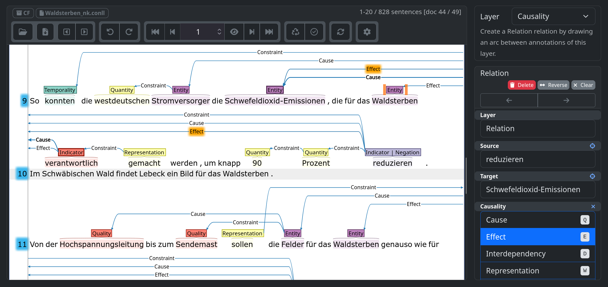

---
format:
  revealjs:
    theme: black
    slide-number: true
    progress: false
    preloadiframes: true
    view-distance: 99
    title-slide: true
    chalkboard: false
    mermaid:
      theme: dark
    logo: resources/tuda_logo.png
    math: mathjax
callout-appearance: minimal
editor:
  render-on-save: true
---

## Kausalsemantik {.smaller}
Eine Operationalisierung am Beispiel der sterben-Komposita im dt. Umweltdiskurs

::: {.notes}
Vielen lieben dank für die Vorstellung und Einführung. 

Liebe Prüfungskommission, Kollegen, Familie und alle Anderen, die sich heute die Zeit genommen haben, hier zu erscheinen. 

Ich freue mich, in den nächsten dreißig Minuten einen Einblick in die Ergebnisse meiner Dissertation zu geben.
:::

<hr></hr>

:::: {.columns}

::: {.column width="55%"}

<br>

> *Landwirtschaft und Pestizide [**verursachen**]{style="color:#87CEEB;"} Bienensterben*.  
 
> *Bienensterben [**bedroht**]{style="color:#FF7F7F;"} Landwirtschaft*.

:::

::: {.column width="5%"}

:::

::: {.column width="40%"}

```{dot}
//| fig-width: 4.25
//| fig-height: 3.25
digraph G {
  bgcolor="transparent";
  node [shape=plaintext, fontcolor=white];
  edge [color=white, fontcolor=white];
  L [label="Landwirtschaft"];
  P [label="Pestizide"];
  B [label="Bienensterben"];
  L -> B [label="0,5    ", fontcolor="#87CEEB"];
  P -> B [label="0,5", fontcolor="#87CEEB"];
  B -> L [label="-1", fontcolor="#FF7F7F"];
}
```
:::
::::


::: footer
Patrick Johnson
:::


<!-- slide -->
## Komponenten {.smaller}

:::: {.columns}

::: {.column width="45%"}
### Methodisch

- Kausalsemantik
  - Extraktion
  - Numerische Projektion

> Wie lässt sich sprachliche Kausalattribution quantifizieren?
:::

::: {.column width="10%"}
:::

::: {.column width="45%"}
### Inhaltlich
- Umweltdiskurs
  - Verantwortung
  - Domänenspezifik

> Wie strukturieren Kausalstrukturen politische Handlungsfähigkeit im dt. Umweltdiskurs?


:::
::::


::: {.notes}
Im Grundsatz besteht die Dissertation aus zwei Komponenten. 

Methodisch führe ich ein Framework zur Extraktion und Projektion sprachlicher Kausalattribution ein.

Inhaltlich wende ich dieses Framework zur Analyse von Verantwortungszuschreibungen im deutschsprachigen Umweltdiskurs an, um das Verhältnis zwischen Kausalstrukturen und politischer Handlungsfähigkeit zu beleuchten.
:::

<!-- slide -->
## UMWELTDISKURSE {.smaller}

<hr>

- Umweltprobleme **diskursiv** definiert (Hannigan <span style="font-size: 0.6em;">2014</span>)
  - <span style="font-size: 0.9em;">[...] *als [seien]{.underline} der technische Fortschritt und der Mensch an sich das [Problem]{.underline}.*</span> <span style="font-size: 0.75em;">[[taz 2019]{.smallcaps}]</span>

<hr>

- Diskursive **Prominenz** korreliert mit politischer Priorität (Downs <span style="font-size: 0.6em;">1972</span>)
  - <span style="font-size: 0.9em;">[...] *Sturmschäden und Borkenkäferbefall als Symptome einer Erkrankung ['totgeschwiegen']{.underline}.*</span><br> <span style="font-size: 0.75em;">[[SZ 1994]{.smallcaps}]</span>
- **Problemwahrnehmung** sinkt mit zeitlicher/räumlicher Distanz (Giddens <span style="font-size: 0.6em;">2009</span>)
  - <span style="font-size: 0.9em;">[...] *Artensterben, die Klimakrise und die Nahrungsmittelkrise noch so [weit weg]{.underline}, dass sie nicht bereit sind, sich und ihr Leben zu ändern.*</span> <span style="font-size: 0.75em;">[[ZEIT 2022]{.smallcaps}]</span>
- „**slow violence**“ (Nixon <span style="font-size: 0.6em;">2011</span>)
  - <span style="font-size: 0.9em;">*Die Ausrottung geschieht lautlos, paradoxerweise [fällt]{.underline} das Insektensterben vielen nur an ihren sauberen Windschutzscheiben [auf]{.underline}.*</span> <span style="font-size: 0.75em;">[[taz 2019]{.smallcaps}]</span>


::: {.notes}
Umweldiskurse verstehe ich dabei als Diskurse um Umweltphänomene mit (zumeist) negativen Auswirkungen für gegenwärtige und zukünftige Lebewesen. Als 'Umweltprobleme' gerahmt stellen diese Phänomene zwar auch eine Bestandsaufnahme, vor allem aber auch eine (mehr oder minder implizite) Forderung nach Verbesserung dar.

Die Prominenz eines Problems – also wie häufig darüber gesprochen wird – beeinflusst die Intensität des politischen Handlungsdrucks. Deutlich zu sehen an Ausdrücken wie *Wir müssen reden über*. 

Zeitlich und räumlich entferntere Problem erscheinen dabei als weniger dringlich, erfahren somit also grundsätzlich weniger Aufmerksamkeit.

Schließlich fließt auch die Geschwindigkeit der Probleme selbst mit ein. 'slow violence' Probleme vollziehen sich so schleichend, dass sie teilweise gar nicht wahrgenommen werden. Beispielsweise kann ein jahrezehntelanger Insektenschwund erst an salienten Alltagserfahrungen wie 'sauberen Windschutzscheiben' auffallen.
:::

<!-- slide -->
## UMWELTKORPUS {.smaller}

:::: {.columns}

::: {.column width="55%"}
- Zeitungstexte & Plenardebatten
- 184 Keywords
  - *Klimawandel*, *Artensterben*, *Fukushima*, *CO2*, *Mikroplastik*, *Pfand*
  - Pro Text mind. ein Keyword
- 1990-2020
  - 413.892 Texte
    - Pro Jahr mind. 10.000
  - 22 Mio. Sätze

:::

::: {.column width="2%"}
:::

::: {.column width="40%"}
```{python}
import pandas as pd
import plotly.express as px
import os

# Updated data file path
file_path = 'dat/yearly_text_counts.dat'

try:
    # 1. Read tab/space-delimited data
    df = pd.read_csv(file_path, sep=r'\s+', engine='python')
    
    # 2. Sum up counts across all years while excluding the year column
    df_summed = df.drop(columns=['year']).sum().reset_index()
    df_summed.columns = ['source', 'text_count']
    
    # Keep original column capitalization (e.g., 'Bild', 'FAZ', 'taz')
    
    # 3. Create the interactive Plotly treemap
    fig = px.treemap(
        df_summed,
        path=['source'],
        values='text_count',
        title=None,
        color_discrete_sequence=px.colors.qualitative.T10,
    )
    
    # --- VISUAL IMPROVEMENTS ---
    fig.update_traces(
        # Specify what text to show on the cells
        textinfo="label+value",
        
        # Format the label: bold source name, line break, and comma-separated values
        texttemplate="<b>%{label}</b><br>%{value:,.0f}",
        
        # Setting a large base font size forces Plotly to automatically 
        # scale down the text for smaller boxes, creating a proportional sizing effect.
        textfont=dict(size=32),
        pathbar_visible=False,
        marker=dict(pad=dict(t=0, l=0, r=0, b=0)),
        tiling=dict(pad=5)
    )
    
    # Optimize layout margins for Quarto HTML rendering engine
    fig.update_layout(
      separators=",.",
      margin=dict(t=0, l=0, r=0, b=0),
      plot_bgcolor="rgba(0,0,0,0)",
      paper_bgcolor="rgba(0,0,0,0)",
      template="plotly_dark",
      
    )
    
    fig.show()

except FileNotFoundError:
    print(f"Error: The target data file was not found at path: {file_path}")
except Exception as e:
    print(f"An unexpected parsing execution error occurred: {e}")
```

:::
::::

<hr></hr>

<div>
<span style="font-size: 0.75em;">📄 Stegmeier, J. & Müller, M. (2025). Die Korpora der DFG-Forschungsgruppe “Kontroverse Diskurse. Sprachgeschichte als Zeitgeschichte seit 1990”. Doi: 10.26083/tuprints-00031401.</span>
</div>

::: {.notes}
Um die Thematisierung von Umweltphänomenen zu untersuchen, habe ich – wie meine Kollegen in der Forschungsgruppe der 'Kontroverse Diskursen' – ein Korpus aus Zeitungstexten und Plenarprotokollen des dt. Bundestags zusammengestellt.

Thematische Ausrichtung wurde das Korpus anhand einer Liste möglichst einschlägiger Umweltausdrücke (Klimawandel, Artensterben, CO2) gewährleistet. Jeder Text soll dabei mindestens eins der Keyword enthalten.

Mit einem Untersuchungszeitraum von 1990-2020 lande ich bei rund 414-Tausend Texten, die ich wiederum in 22 Millionen Sätze segmentiert habe.
:::


<!-- slide -->
## *-STERBEN* {.smaller}

:::: {.columns}

::: {.column width="50%"}
<div style="text-align: center;margin-bottom: -10px;margin-top: 40px;">
<span style="font-size: 1em;">$\textit{WABI}$</span>
</div>

```{python}
import pandas as pd
import plotly.express as px
import os

# Path to the data file
file_path = 'dat/wabi_yearly.dat'

try:
    # Read the data from the .dat file
    df = pd.read_csv(file_path, sep=r'\s+', engine='python')

    # Convert the DataFrame from wide to long format for Plotly
    df_long = df.melt(id_vars=['year'], 
                      var_name='term', 
                      value_name='mentions')
    df_long['term'] = df_long['term'].str.capitalize()
    # Create the Plotly line chart
    fig = px.line(df_long, 
                  x='year', 
                  y='mentions', 
                  color='term',
                  labels={"year": "", "mentions": "", "term": ""},
                  color_discrete_sequence=px.colors.qualitative.T10,
                  title="")

    fig.add_annotation(
      x=2017,                      # Matches your 'year' column value
      y=100,                       # Adjust to sit slightly above your actual bar value
      text="'Krefelder Studie'",
      showarrow=True,
      arrowhead=2,
      arrowsize=1,
      arrowwidth=1.5,
      arrowcolor="white",
      ax=-75,                        # X offset for text box (0 means perfectly centered above)
      ay=-50,                      # Y offset for text box (negative moves it up)
      font=dict(size=16, color="white"),
      bgcolor="rgba(30, 30, 30, 0.8)",
      bordercolor="rgba(200, 200, 200, 0.4)",
      borderwidth=1,
      borderpad=4
    )

    # Update the layout for a dark, transparent theme
    fig.update_layout(
        plot_bgcolor="rgba(0,0,0,0)",
        paper_bgcolor="rgba(0,0,0,0)",
        template="plotly_dark",
        xaxis=dict(
            showgrid=True,
            gridcolor="rgba(200, 200, 200, 0.01)",
            tickmode="linear",
            tick0=df['year'].min(),
            dtick=2,
            tickangle=45
        ),
        yaxis=dict(
            showgrid=True,
            gridcolor="rgba(200, 200, 200, 0.1)"
        ),
        legend=dict(
            orientation="h",
            yanchor="bottom",
            y=0.95,
            xanchor="right",
            x=0.85,
        ),
        showlegend=False,
        margin=dict(l=0, t=15),
        width=515,
        height=350
    )

    # Show the plot
    fig.show()

except FileNotFoundError:
    print(f"Error: The file '{file_path}' was not found.")
except Exception as e:
    print(f"An error occurred: {e}")

```
:::

::: {.column width="6%"}
:::

::: {.column width="40%"}
| **Form** | **#** | **\%** |
| :--- | :---: | :---: |
| *Aussterben* | 3812 | 35% |
| <span style="color: #72b6b1;">—</span> ***Waldsterben*** | 1837 | 15% |
| <span style="color: #4c78a8;">—</span> ***Artensterben*** | 1562 | 13% |
| *Massensterben* | 692 | 6% |
| <span style="color: #f58518;">—</span> ***Bienensterben*** | 549 | 4% |
| <span style="color: #e45756;">—</span> ***Insektensterben*** | 490 | 4% |
| *Fischsterben* | 450 | 4% |
| *Absterben* | 373 | 3% |
: {tbl-colwidths="[90,10,10]"}
:::
::::

<hr>

$\small \text{Annotationskorpus (4.434 Sätze): }  \textit{Artensterben}, \textit{Bienensterben}, \textit{Insektensterben}, \textit{Waldsterben}$

::: {.notes}
Da sich 22 Millionen Sätze nur schwer manuell bearbeiten lassen, beschränkt sich der Großteil meiner Analyse auf eine morphologische Familie. Die *sterben*-Kompostita umfassen sowohl generischere (bspw. *Aussterben*) als auch geschlossenere Ausdrücke wie *Wald-*, *Arten-*, *Bienen-* oder *Insektensterben*.

Diese vier Lemmata stellen das primäre Untersuchungsobjekt meines Analysekapitels dar. Auf der linken Seite sehen wir ihre Verlaufskurven visualisiert. Ich werde im weiteren Verlauf noch gesondert auf einzelne Hoch- und Tiefphasen eingehen. 

Hier möchte ich nur kurz auf *Insektensterben* (in rot) verweisen, dass erst so wirklich ab 2017 als Begriff erscheint. In diesem Jahr wurde auch eine Studie von Hallmann et al. publiziert. Im Rahmen dieser 'Krefelder Studie' wurde die Biomasse von Fluginsekten von 1989 bis 2016 gemessen und ein Rückgang der Biomasse um 75% attestiert. 

Neben den vorher erwähnten 'sauberen Windschutzscheiben' tragen also auch wissenschaftliche Publikationen maßgeblich zur Wahrnehmung von schleichender Problem bei.
:::

<!-- slide -->
## VERANTWORTUNG {.smaller}

<hr>

- **Kausaltyp** $\to$ Konsequenz (Stone <span style="font-size: 0.6em;">1989</span>; Fischer <span style="font-size: 0.6em;">2003</span>)
  - **Natürlich/Mechanisch** $\to$ hemmt Verantwortungsübernahme
    - <span style="font-size: 0.9em;">*Die Industrie führt das Bienensterben auf die [Varroa-Milbe]{.underline} zurück und nicht auf die eigenen Pestizide.*</span> <span style="font-size: 0.75em;">[[SZ 2018]{.smallcaps}]</span>
  - **Technisch** $\to$ Umrüstung
    - <span style="font-size: 0.9em;">*Als das Waldsterben für Schlagzeilen sorgte, sind sie auf Autos mit [Katalysator]{.underline} umgestiegen.*</span> <span style="font-size: 0.75em;">[[ZEIT 2006]{.smallcaps}]</span>
  - **Strukturell** $\to$ Systemtransformation 
    - <span style="font-size: 0.9em;">*Ohne [Agrarwende]{.underline} müssen wir das Insektensterben akzeptieren und bestäuben in 30 Jahren die Pflanzen per Hand.*</span> <span style="font-size: 0.75em;">[[taz 2018]{.smallcaps}]</span>
  - **Polykausal** $\to$ Verantwortungsdiffusion (Iyengar <span style="font-size: 0.6em;">1991</span>)
    - <span style="font-size: 0.9em;">*Dabei gebe es für das Bienensterben viele Ursachen, außer dem Einsatz von [Pestiziden]{.underline} auch [Wetterveränderungen]{.underline} und [Milbenbefall]{.underline}.*</span> <span style="font-size: 0.75em;">[[ZEIT 2018]{.smallcaps}]</span>

::: {.notes}
Die Wahrnehmung bzw. Bestandaufnahme ist jedoch nur der erste Schritt. Denn Probleme erfordern Lösungen, die sich nach Stone und Fisher an unterschiedliche Kausaltypen koppeln lassen. 

Der natürliche Typ ist besonders aus dem Klimawandel-Diskurs bekannt. 'Natürliche' Probleme hemmen Verantwortung, weil menschliche Akteure entweder nicht eingreifen können oder sollten. Technisch-induzierte Probleme münden dagegen in Um-/ bzw. Nachrüstung, beispielsweise von Filtern oder Katalysatoren.

Weitaus schwieriger gestalten sich Probleme, die ganze Strukturen betreffen. Der Übergang von einer industriellen zu einer ökologischen Landwirtschaft soll im Rahmen einer großangelegten Agrarwende erfolgen.

Insbesondere diese strukturell-bedingten Probleme lassen sich nicht mehr durch isolierte Einzelursachen erklären. Globale Makrokrisen (Klimawandel, Artensterben) erwachsen aus einem Arrangement unterschiedlicher Faktoren. Damit verteilt sich die Verantwortung, bis sich in Extremfällen niemand mehr zuständig fühlt.
:::

<!-- slide -->
## KAUSALATTRIBUTION {.smaller}

:::: {.columns}

::: {.column width="45%"}
### Rehbein / Ruppenhofer <span style="font-size: 0.6em;">(2017)</span>
- Verb-zu Konstruktion
  - *$C$ [führt]{.underline} [zu]{.underline} $E$*
- Transitive-kausative Konstruktion
  - *$C$ [verursacht]{.underline} $E$*
- Präpositionale Konstruktion
  - *[Durch]{.underline} $C$ [entsteht]{.underline} $E$*
:::

::: {.column width="10%"}

:::

::: {.column width="45%"}
### Dunietz et al. <span style="font-size: 0.6em;">(2017)</span>
- [FACILITATE]{style="color:#87CEEB;"} 'erleichtern'
  - *We are in serious economic trouble [because]{.underline} [of]{.underline} inadequate regulation.*
- [INHIBIT]{style="color:#FF7F7F;"} 'hemmen'
  - *The new regulations should [prevent]{.underline} future crises.*
:::
::::

::: {.notes}
Die methodische Herausforderung besteht nun darin, Kausalattributionen aus natürlichen Sprachdaten zu extrahieren. Im Feld der 'Kausalrelationsextraktion' knüpfe ich an Rehbein / Ruppenhofer an. Sie konzentrieren sich insbesondere auf kompakte Konstruktionen, darunter x führt zu y / x verursacht y / y durch x usw. 

Weiter übernehme ich Dunietz Unterscheidung zwischen fördernden und hemmenden Relationen. Deutschsprachige Indikatoren wie *verursachen* und *stoppen* grenze ich damit voneinander ab.
:::

<!-- slide -->
## EXZERPTE I {.smaller}
### Fördernd
- ***Fipronil** wird für das **Bienensterben** [mitverantwortlich]{.underline style="color:#87CEEB;"} gemacht.* <span style="font-size: 0.75em;">[[taz 2013]{.smallcaps}]</span>

<hr>

### Hemmend
- *Die grüne **Landwirtschaftsministerin** hat das **Waldsterben** [gestoppt]{.underline style="color:#FF7F7F;"}.* 
<span style="font-size: 0.75em;">[[taz 2003]{.smallcaps}]</span>

::: {.notes}
Dieses Vorgehen lässt sich direkt auf zwei Belege aus dem Korpus anwenden. *mitverantwortlich* weist *Fipronil* als fördernde Ursache von *Bienensterben* aus. *gestoppt* markiert *Landwirtschaftsministerin* als hemmend ggü. *Waldsterben*.

*mit* in *mitverantrortlich* verweist jedoch auf eine methodische Lücke. Im Gegensatz zu *verantwortlich* ist *mitverantwortlich* inhärent polykausal.
:::

<!-- slide -->
## INDIKATOREN {.smaller}
$\small (C = \text{Cause}; E = \text{Effect}; I = [-1, 1])$

<hr></hr>

:::: {.columns}

::: {.column width="45%"}
### Hemmend
#### Mono ([$\small -1$]{style="color:#FF7F7F;"})
- $C$ *stoppt* / *verhindert* / *gegen* $E$

<hr></hr>

#### Prio ([$\small -0{,}75$]{style="color:#FF7F7F;"})
- $C$ *ist die größte Bedrohung für* $E$

<hr></hr>

#### Poly ([$\small -0{,}5$]{style="color:#FF7F7F;"})
- $C$ *reduziert* / *mindert* $E$
:::

::: {.column width="5%"}

:::

::: {.column width="45%"}
### Fördernd
#### Mono ([$\small +1$]{style="color:#87CEEB;"})
- $C$ *ist* *der* *Grund* / *verantwortlich* *für* $E$

<hr></hr>

#### Prio ([$\small +0{,}75$]{style="color:#87CEEB;"})
- $C$ *ist der Hauptgrund für* $E$

<hr></hr>

#### Poly ([$\small +0{,}5$]{style="color:#87CEEB;"})
- $C$ *verstärkt* / *intensiviert* $E$

:::
::::

<hr>

$\pm =$  Polarität; $||I|| =$ Salienz


::: {.notes}
Daher ergänze ich die bestehende Unterscheidung zwischen hemmenden und fördernden Indikatoren.

Während Polarität (hemmend / fördernd) das Vorzeichen (-/+) stellt, beschreibt Salienz das Maß der Exklusvität – hier von polykausal (0.5) zu monokausal (1).

Zusammengenommen ergibt sich ein numerischer Wert auf einer Skala von -1 (monokausal hemmend) bis 1 (monokausal fördernd) – fortan als Einfluss bezeichnet.
:::

<!-- slide -->
## EXZERPTE I {.smaller}
### Fördernd
- ***Fipronil** wird für das **Bienensterben** [mitverantwortlich]{.underline style="color:#87CEEB;"} gemacht.*  
<span style="font-size: 0.75em;">[[taz 2013]{.smallcaps}]</span>

$$
(\text{Fipronil}; \text{Bienensterben}; 0{,}5)
$$

<hr>

### Hemmend
- *Die grüne **Landwirtschaftsministerin** hat das **Waldsterben** [gestoppt]{.underline style="color:#FF7F7F;"}.* 
<span style="font-size: 0.75em;">[[taz 2003]{.smallcaps}]</span>

$$
(\text{Landwirtschaftsministerin}; \text{Waldsterben}; -1)
$$

::: {.notes}
Somit modifiziert *mit* in *mitverantwortlich* den Einfluss von *Fipronil* ggü. *Bienensterben* zu 0,5.

*gestoppt* grenzt sich davon sowohl durch das Vorzeichen (-) als auch durch seine monokausale Salienz (1) ab.
:::

<!-- slide -->
## KONTEXTMARKER I {.smaller}
$\small (C = \text{Cause}; E = \text{Effect}; I = [-1, 1])$

<hr></hr>

:::: {.columns}

::: {.column width="45%"}
#### Prio ($\small ||I|| = 0{,}75$)
- [*vor allem*]{.underline} $C$ *verursacht* $E$
- $C$ *ist [*wesentlich*]{.underline} an* $E$ *beteiligt*

<hr></hr>

#### Poly ($\small ||I|| = 0{,}5$)
- [*Unter anderem*]{.underline} $C$ *verursacht* $E$
- [*Nicht nur*]{.underline} $C$ *verursacht* $E$
:::

::: {.column width="5%"}

:::

::: {.column width="45%"}
> *Das **Insektensterben** ist wahrscheinlich [maßgeblich]{.underline} auf die intensive **Landwirtschaft** [zurückzuführen]{.underline style="color:#87CEEB;"}.*
<span style="font-size: 0.75em;">[[SZ 1992]{.smallcaps}]</span>
$$
(\text{Landwirtschaft}; \text{Insektensterben}; 0{,}75)
$$

:::
::::

<hr>

$\pm =$  Polarität; $||I|| =$ Salienz


::: {.notes}
Schließlich kann der Einfluss noch durch eine Reihe an Kontextmarkern modifiziert werden: Priorisierungen wie *vor allem*, *wesentlich* oder *maßgeblich* setzen den absoluten Einfluss auf 0,75. 

Polykausale Marker wie *unter anderem* entsprechend auf 0,5.
:::

<!-- slide -->
## KONTEXTMARKER II {.smaller}
$\small (C = \text{Cause}; E = \text{Effect}; I = [-1, 1])$

<hr></hr>

:::: {.columns}

::: {.column width="45%"}
### Negation
#### Propositional ($\small I \cdot 0$)
- $C$ *ist* [*nicht*]{.underline} *der Grund* *für* $E$

<hr></hr>

#### Objektbasiert ($\small I \cdot$ [$-1$]{style="color:#FF7F7F;"})
- $C$ *verursacht die [*Vernichtung*]{.underline} von* $E$
:::

::: {.column width="5%"}

:::

::: {.column width="45%"}
> *Neben dem **Insektensterben** [leiden]{.underline style="color:#FF7F7F;"} diese **Arten** auch unter einem [Mangel]{style="color:#FF7F7F;"} an **Brutplätzen**.* 
<span style="font-size: 0.75em;">[[SZ 2018]{.smallcaps}]</span>
$$
(\text{Insektensterben}; \text{Arten}; -0{,}5)
$$
$$
(\text{Brutplätze}; \text{Arten}; 0{,}5)
$$
:::
::::

<hr>

$\pm =$  Polarität; $||I|| =$ Salienz


::: {.notes}
Negation fließt in zwei verschiedenen Formen ein. 

Propositionale Negation – bspw. *nicht* oder *keine* in *keine Schuld* – neutralisiert den Einfluss, setzt ihn also auf 0. Objektbasierte Negationen (darunter *Vernichtung*, *Schwund* oder *Mangel*) invertieren die Richtung.

Im Beispiel rechts projiziert *leiden* einen Einfluss von -1. Dieser Einfluss verteilt sich auf die Ursachen *Insektensterben* und *Brutplätze* mit jeweils -0.5. *Mangel* interviert wiederum den Einfluss von *Brutplätzen*, so dass *Brutplätze* *Arten* positiv affizieren.
:::

<!-- slide -->
## AGGREGATION {.smaller}
$\small (C = \text{Cause}; E = \text{Effect}; I = [-1, 1])$

<hr></hr>

:::: {.columns}

::: {.column width="45%"}
### Summierung

$$
\begin{split}
(\text{Verkehr}; \text{Waldsterben}; 0{,}5) \\
+ (\text{Verkehr}; \text{Waldsterben}; 1) \\ \\
(\text{Autos}; \text{Waldsterben}; 0{,}5) \\ \\
\overline{= (\text{Verkehr}; \text{Waldsterben}; 1{,}5)} \\
(\text{Autos}; \text{Waldsterben}; 0{,}5) \\
\end{split}
$$

:::

::: {.column width="5%"}

:::

::: {.column width="45%"}
### Normalisierung

- Globaler Gesamteinfluss: $1{,}5 + 0{,}5 = 2$
$$
\begin{split}
(\text{Verkehr}; \text{Waldsterben}; 1{,}5 \;/ \;2) \\
(\text{Autos}; \text{Waldsterben}; 0{,}5 \;/ \;2) \\ \\
\overline{= (\text{Verkehr}; \text{Waldsterben}; 0{,}75)} \\
(\text{Autos}; \text{Waldsterben}; 0{,}25) \\
\end{split}
$$


:::
::::


::: {.notes}
Schließlich werden die Tupeln aggregiert. Der Einfluss identischer Ursache-Wirkungsstellen wird addiert: Hier summieren sich die zwei Tupel mit *Verkehr* zu einem Einfluss von 1,5.

Zusammen mit dem Einfluss von *Autos* (0,5) ergibt sich hier ein globaler Gesamteinfluss ggü. Waldsterben von 2. Die individuellen Einflusswerte werden schließlich durch eben diesen Gesamteinfluss dividiert. Als Ergebnis beläuft sich der anteilige Einfluss von *Verkehr* ggü. *Waldsterben* auf 0,75.

Das Framework ermöglicht somit, beliebige Bündel aus Tupeln zu bilden. Beispielsweise, wenn mich die Ursachen von Waldsterben interessieren.
:::

<!-- slide -->
## PHASEN (WALDSTERBEN) {.smaller}

:::: {.columns}

::: {.column width="100%"}

```{python}
import pandas as pd
import plotly.express as px
import os

# Path to the data file
file_path = 'dat/wabi_yearly.dat'

try:
    # Read the data from the .dat file
    df = pd.read_csv(file_path, sep=r'\s+', engine='python')
    # Convert the DataFrame from wide to long format for Plotly
    df_long = df.melt(id_vars=['year'], 
                      var_name='term', 
                      value_name='mentions')
    df_long = df_long[df_long['term'] == 'waldsterben']
    df_long['term'] = df_long['term'].str.capitalize()
    # Create the Plotly line chart
    fig = px.bar(df_long, 
                  x='year', 
                  y='mentions', 
                  color='term',
                  labels={"year": "", "mentions": "", "term": ""},
                  color_discrete_sequence=['#72b6b1'],
                  title="")

    fig.add_vrect(
      x0=1990 - 0.4, x1=2002 + 0.4,
      fillcolor="rgba(255, 255, 255, 0.05)",  # Subtle tint for dark theme
      opacity=0.5,
      layer="below",
      line_width=1,
      line_color="rgba(255, 255, 255, 0.2)",
      annotation_text="I",
      annotation_position="top",
      annotation_font=dict(size=24, color="rgba(255, 255, 255, 0.7)")
    )

    fig.add_vrect(
      x0=2003 - 0.4, x1=2018 + 0.4,
      fillcolor="rgba(255, 255, 255, 0.05)",  # Subtle tint for dark theme
      opacity=0.5,
      layer="below",
      line_width=1,
      line_color="rgba(255, 255, 255, 0.2)",
      annotation_text="II",
      annotation_position="top",
      annotation_font=dict(size=24, color="rgba(255, 255, 255, 0.7)")
    )

    fig.add_vrect(
      x0=2019 - 0.4, x1=2020 + 0.4,
      fillcolor="rgba(255, 255, 255, 0.05)",  # Subtle tint for dark theme
      opacity=0.5,
      layer="below",
      line_width=1,
      line_color="rgba(255, 255, 255, 0.2)",
      annotation_text="III",
      annotation_position="top",
      annotation_font=dict(size=24, color="rgba(255, 255, 255, 0.7)")
    )

    fig.add_annotation(
      x=2003,                      # Matches your 'year' column value
      y=63,                       # Adjust to sit slightly above your actual bar value
      text="'Trendumkehr'",
      showarrow=True,
      arrowhead=2,
      arrowsize=1,
      arrowwidth=1.5,
      arrowcolor="white",
      ax=0,                        # X offset for text box (0 means perfectly centered above)
      ay=-85,                      # Y offset for text box (negative moves it up)
      font=dict(size=16, color="white"),
      bgcolor="rgba(30, 30, 30, 0.8)",
      bordercolor="rgba(200, 200, 200, 0.4)",
      borderwidth=1,
      borderpad=4
    )

    fig.add_annotation(
      x=2019,                      # Matches your 'year' column value
      y=113,                       # Adjust to sit slightly above your actual bar value
      text="'Waldsterben 2.0'",
      showarrow=True,
      arrowhead=2,
      arrowsize=1,
      arrowwidth=1.5,
      arrowcolor="white",
      ax=-30,                        # X offset for text box (0 means perfectly centered above)
      ay=-45,                      # Y offset for text box (negative moves it up)
      font=dict(size=16, color="white"),
      bgcolor="rgba(30, 30, 30, 0.8)",
      bordercolor="rgba(200, 200, 200, 0.4)",
      borderwidth=1,
      borderpad=4
    )


    # Update the layout for a dark, transparent theme
    fig.update_layout(
        plot_bgcolor="rgba(0,0,0,0)",
        paper_bgcolor="rgba(0,0,0,0)",
        template="plotly_dark",
        xaxis=dict(
            showgrid=True,
            gridcolor="rgba(200, 200, 200, 0.01)",
            tickmode="linear",
            tick0=df['year'].min(),
            dtick=2,
            tickangle=45
        ),
        yaxis=dict(
            showgrid=True,
            gridcolor="rgba(200, 200, 200, 0.1)"
        ),
        legend=dict(
            orientation="h",
            yanchor="bottom",
            y=0.95,
            xanchor="right",
            x=0.85,
        ),
        showlegend=False,
        margin=dict(l=0, t=15),
        # width=515,
        # height=350
    )

    # Show the plot
    fig.show()

except FileNotFoundError:
    print(f"Error: The file '{file_path}' was not found.")
except Exception as e:
    print(f"An error occurred: {e}")

```
:::

::: {.column width="0%"}
:::

::: {.column width="0%"}
:::
::::

<hr>
<div>
<span style="font-size: 0.75em;">📄 Johnson, P. (2026). *Waldsterben 2.0 -- Climate change as an attributed cause of forest diebacks*. In: Landscapes in Language, Society and Cognition (Interdisciplinary Linguistics). Berlin/Boston: De Gruyter Mouton. (i. Dr.)</span>
</div>

::: {.notes}
Um aber 30 Jahre 'nicht in einen Topf zu werfen', habe ich jedes WABI in individuelle Phasen segmentiert. Die Länge und Anzahl der Phasen erfolgt zum einen anhand der Daten selbst (Anzahl Belege oder Jahre), aber auch anhand prominenter Zäsuren.

Im Falle Waldsterben nehmen wir nach einer Hochphase in den 90er Jahren eine stetige Reduktion der jährlichen Frequenz wahr. 2003 kommt es zu einer kurzzeitigen Resurgenz, als die damalige Bundeslandwirtschaftsministerin Renate Künäst das Waldsterben für beendet erklärt.

Darauf folgt eine Ruhephase von 15 Jahren, bevor Waldsterben wieder als *neues* *Waldsterben* – bzw. *Waldsterben 2.0* – hofiert.
:::


<!-- slide -->
## URSACHEN (WALDSTERBEN) {.smaller}
<hr>

:::: {.columns}
::: {.column width="45%"}
> *Etwa 58 Prozent der gesamten **Stickoxid**- Emissionen und 22 Prozent der **Kohlendioxid**-Emissionen, die für **Waldsterben** und Treibhauseffekt [verantwortlich]{.underline style="color:#87CEEB;"} sind, werden vom Straßenverkehr im EG-Bereich produziert.*<br>
<span style="font-size: 0.75em;">[[taz 1990]{.smallcaps}]</span>
:::

::: {.column width="5%"}
:::

::: {.column width="45%"}
### 1990-2002
| [Cause]{.smallcaps .underline} | [n]{.underline} | [∅ I]{.underline} | [% I]{.underline} |
| :----------------------------- | --------------: | ----------------: | ----------------: |
| *Saurer Regen*                 |               9 |              0,87 |               6,0 |
| *Stickoxid*                    |              10 |              0,56 |               4,1 |
| *Luftverschmutzung*            |               5 |              0,90 |               3,4 |
| ***Autos***                    |               6 |              0,69 |               3,1 |
| *Schwefeldioxid*               |               5 |              0,78 |               2,9 |
| *Ozon*                         |               6 |              0,54 |               2,5 |
| ***Verkehr***                  |               4 |              0,75 |               2,3 |
:::
::::

<hr>

:::: {.columns}
::: {.column width="45%"}
:::

::: {.column width="5%"}
:::

::: {.column width="50%"}
<div>
<span style="font-size: 0.75em;">Gesamt: ∅ $||I||$ = 0,69 über 119 Entitäten (n=187)</span>
</div>
:::
::::

::: {.notes}
Betrachtet man nun die der fördernden Ursachen von Waldsterben bis 2002, springt die Dominanz schadstofforienter Attributionen hervor.

*Stick-*, *Kohlen-* und *Schwefeldioxide* lese ich als Präzisierung von Luftverschmutzung. Einige Belege führen die Emissionen auch auf *Verkehr* oder konkrete Verkehrsmittel (hier: *Autos*) züruck.

Bevor wir zur zweiten Phase übergehen, möchte ich noch kurz auf die Fallzahlen verweisen. In der ersten Phase sind das noch 187 Ursachen in 12 Jahren. 
:::

<!-- slide -->
## URSACHEN (WALDSTERBEN) {.smaller}
<hr>

:::: {.columns}
::: {.column width="45%"}
> *Die Folgen davon bekommt er noch heute zu spüren, wenn es in der Klimadebatte heißt, dass auch das **Waldsterben** letztlich eine [Erfindung]{.underline style="color:#87CEEB;"} der **Wissenschaft** gewesen sei, und das ist der Schaden, der bleibt.*<br><span style="font-size: 0.75em;"> [[FAZ 2013]{.smallcaps}]</span>
:::

::: {.column width="5%"}
:::

::: {.column width="45%"}
### 2003-2018
| [Cause]{.smallcaps .underline} | [n]{.underline} | [∅ I]{.underline} | [% I]{.underline} |
| :----------------------------- | --------------: | ----------------: | ----------------: |
| *Saurer Regen*              |               4 |              0,81 |              10,0 |
| *Schwefeldioxid*            |               3 |              0,92 |              8,5 |
| *Unternehmen*                  |               2 |              0,75 |               4,6 |
| ***Wissenschaft***                       |               1 |              1,00 |               3,1 |
| *Ökobauern*              |               1 |              1,00 |               3,1 |
| *Altlast*                 |               1 |              1,00 |               3,1 |
| *Braunkohlekraftwerk*                       |               1 |              1,00 |               3,1 |
:::
::::

<hr>

:::: {.columns}
::: {.column width="45%"}
:::

::: {.column width="5%"}
:::

::: {.column width="50%"}
<div>
<span style="font-size: 0.75em;">Gesamt: ∅ $||I||$ = 0,79 über 35 Entitäten (n=41)</span>
</div>
:::
::::

::: {.notes}
In der zweiten Phase (die 15 Jahre umfasst), sinkt die Anzahl der Ursachen auf 41. Der Fokus auf Emissionen nimmt ebenso ab.

Dagegen nimmt die Prominz von Rahmungen zu, die man auch aus dem Diskurs um den Klimawandel kennt. 

Waldsterben wird als *Erfindung*, *Medienmärchen* oder *Hysterie* bezeichnet. Das Waldsterben wurde nach dieser Lesart also nicht umgekehrt, da es nicht oder nur in einem unproblematischen Ausmaß existiert hat.
:::

<!-- slide -->
## URSACHEN (WALDSTERBEN) {.smaller}
<hr>

:::: {.columns}
::: {.column width="45%"}
> *Es mehren sich die Signale, dass wir [durch]{.underline style="color:#87CEEB;"} den **Klimawandel** in Deutschland auf ein neues **Waldsterben** zusteuern.*<br><span style="font-size: 0.75em;">[[taz 2019]{.smallcaps}]</span>
:::

::: {.column width="5%"}
:::

::: {.column width="45%"}
### 2019-2020
| [Cause]{.smallcaps .underline} | [n]{.underline} | [∅ I]{.underline} | [% I]{.underline} |
| :----------------------------- | --------------: | ----------------: | ----------------: |
| ***Klimawandel***              |               8 |              0,71 |              27,5 |
| *Luftverschmutzung*            |               2 |              1,00 |              11,6 |
| *Trockenheit*                  |               2 |              1,00 |               11,6 |
| *Hirsch*                       |               1 |              1,00 |               5,8 |
| *Erderwärmung*              |               1 |              1,00 |               5,8 |
| *Saurer Regen*                 |               4 |              0,25 |               5,8 |
| *Dürre *                       |               1 |              1,00 |               5,8 |
:::
::::

<hr>

:::: {.columns}
::: {.column width="45%"}
:::

::: {.column width="5%"}
:::

::: {.column width="50%"}
<div>
<span style="font-size: 0.75em;">Gesamt: ∅ $||I||$ = 0,66 über 15 Entitäten (n=29)</span>
</div>
:::
::::


::: {.notes}
In jedem Fall nimmt der Diskurs um Waldsterben 2019 wieder schlagartig Fahrt auf. Konkret steigt die jährliche Anzahl fördernder Ursachen auf das Fünffache.

Inhaltlich sticht dabei die Präsenz von *Klimawandel* und seinen Ausläufern (*Trockenheit*, *Dürre* oder *Hitze*) hervor. Hinzu gesellen sich verstärkt nicht-menschliche Tiere, darunter *Hirsch*, *Wild* oder *Borkenkäfer*.

Kurzum erfolgt bei den attributierten Ursachen von Waldsterben also eine Substitution. Insbesondere die Verschiebung von *Luftverschmutzung* zu *Klimawandel* ist interessant – da Klimawandel gemeinhin selbst auf Luftverschmutzung zurückgeführt wird. 
:::

<!-- slide -->
## URSACHEN {.smaller}
<hr>

:::: {.columns}
::: {.column width="45%"}
<!-- ### Waldsterben
- **1990-2002**
  - Schadstoffe (*Stickoxide*, *Schwefeldioxid*)
- **2003-2018**
  - "Medienmärchen" (*Hysterie*)
- **2019-2020**
  -  Klima (*Klimawandel*, *Trockenheit*, *Dürre*) -->

### Artensterben
- **1990-2009**
  - Generisch anthropogen (*Mensch*) & Himmelskörper (*Meteorit*)
- **2010-2017**
  - Landwirtschaft (*Monokultur*)
- **2018-2020**
  - Mensch + Landwirtschaft

:::

::: {.column width="5%"}
:::

::: {.column width="50%"}
### Bienensterben
- **1990-2013**
  - Pestizidprodukte (*Poncho Pro*, *Bayer*)
- **2014-2020**
  - Neonikotinoide & Landwirtschaft

### Insektensterben
- **2017-2018**
  - Pestizide & Landwirtschaft
- **2019-2020**
  - \+ Lichtverschmutzung
:::
::::

::: {.notes}
Aus Zeitgründen würde ich die fördernden Ursachen der anderen WABI hier nur kurz umreißen. 

Mir geht es vor allem darum, Waldsterben als Ausreißer zu markieren. Wir nehmen nämlich bei keinem anderen WABI eine nennenswerte Präsenz von Luftverschmutzung wahr. Lediglich bei Artensterben erscheint *Erderwärmung* vereinzelt als Repräsentant klimatischer Faktoren in der ersten Phase. Der Fokus liegt jedoch weitaus stärker auf generisch anthropogenen Faktoren (*der Mensch*) und extraterrestischen Einflüssen (*Meteorit*, *Supernova*).

Darauf folgt Landwirtschaft (u. a. in Form von *Monokultur*). Grundsätzlich ist Landwirtschaft sehr präsent: sowohl in der zweiten Phase von Bienensterben und durchgängig bei Insektensterben. Ebenso sind bei beiden WABI Pestizide in unterschiedlichen Spezifikationsgraden hochgradig vertreten.

Allgemein scheint ein struktureller Trend vorzuliegen. Fördernde Ursachen werden tendenziell diverser. Auch Bienensterben beginnt mit spezifischen Produkten (und Herstellern), bevor in der zweiten Phase verstärkt landwirtschaftliche Ursachen erscheinen.
:::

<!-- slide -->
## PHASEN (BIENENSTERBEN) {.smaller}

:::: {.columns}

::: {.column width="100%"}

```{python}
import pandas as pd
import plotly.express as px
import os

# Path to the data file
file_path = 'dat/wabi_yearly.dat'

try:
    # Read the data from the .dat file
    df = pd.read_csv(file_path, sep=r'\s+', engine='python')
    # Convert the DataFrame from wide to long format for Plotly
    df_long = df.melt(id_vars=['year'], 
                      var_name='term', 
                      value_name='mentions')
    df_long = df_long[df_long['term'] == 'bienensterben']
    df_long['term'] = df_long['term'].str.capitalize()
    # Create the Plotly line chart
    fig = px.bar(df_long, 
                  x='year', 
                  y='mentions', 
                  color='term',
                  labels={"year": "", "mentions": "", "term": ""},
                  color_discrete_sequence=['#f58518'],
                  title="")

    fig.add_vrect(
      x0=1990 - 0.4, x1=2013 + 0.4,
      fillcolor="rgba(255, 255, 255, 0.05)",  # Subtle tint for dark theme
      opacity=0.5,
      layer="below",
      line_width=1,
      line_color="rgba(255, 255, 255, 0.2)",
      annotation_text="I",
      annotation_position="top",
      annotation_font=dict(size=24, color="rgba(255, 255, 255, 0.7)")
    )

    fig.add_vrect(
      x0=2014 - 0.4, x1=2020 + 0.4,
      fillcolor="rgba(255, 255, 255, 0.05)",  # Subtle tint for dark theme
      opacity=0.5,
      layer="below",
      line_width=1,
      line_color="rgba(255, 255, 255, 0.2)",
      annotation_text="II",
      annotation_position="top",
      annotation_font=dict(size=24, color="rgba(255, 255, 255, 0.7)")
    )

    fig.add_annotation(
      x=2008,                      # Matches your 'year' column value
      y=45,                       # Adjust to sit slightly above your actual bar value
      text="Oberrheingraben",
      showarrow=True,
      arrowhead=2,
      arrowsize=1,
      arrowwidth=1.5,
      arrowcolor="white",
      ax=0,                        # X offset for text box (0 means perfectly centered above)
      ay=-120,                      # Y offset for text box (negative moves it up)
      font=dict(size=16, color="white"),
      bgcolor="rgba(30, 30, 30, 0.8)",
      bordercolor="rgba(200, 200, 200, 0.4)",
      borderwidth=1,
      borderpad=4
    )

    fig.add_annotation(
      x=2013,                      # Matches your 'year' column value
      y=60,                       # Adjust to sit slightly above your actual bar value
      text="Freilandverbot<br>(3 Neonikotinoide)",
      showarrow=True,
      arrowhead=2,
      arrowsize=1,
      arrowwidth=1.5,
      arrowcolor="white",
      ax=0,                        # X offset for text box (0 means perfectly centered above)
      ay=-40,                      # Y offset for text box (negative moves it up)
      font=dict(size=16, color="white"),
      bgcolor="rgba(30, 30, 30, 0.8)",
      bordercolor="rgba(200, 200, 200, 0.4)",
      borderwidth=1,
      borderpad=4
    )


    # Update the layout for a dark, transparent theme
    fig.update_layout(
        plot_bgcolor="rgba(0,0,0,0)",
        paper_bgcolor="rgba(0,0,0,0)",
        template="plotly_dark",
        xaxis=dict(
            showgrid=True,
            gridcolor="rgba(200, 200, 200, 0.01)",
            tickmode="linear",
            tick0=df['year'].min(),
            dtick=2,
            tickangle=45
        ),
        yaxis=dict(
            showgrid=True,
            gridcolor="rgba(200, 200, 200, 0.1)"
        ),
        legend=dict(
            orientation="h",
            yanchor="bottom",
            y=0.95,
            xanchor="right",
            x=0.85,
        ),
        showlegend=False,
        margin=dict(l=0, t=15),
        # width=515,
        # height=350
    )

    # Show the plot
    fig.show()

except FileNotFoundError:
    print(f"Error: The file '{file_path}' was not found.")
except Exception as e:
    print(f"An error occurred: {e}")

```
:::

::: {.column width="0%"}
:::

::: {.column width="0%"}
:::
::::

::: {.notes}
Zwei mögliche Gründe für diese Erweiterung habe ich in der Verlaufskurve von Bienensterben markiert. Nach einem Bienensterben in den USA (2007) wird vor allem ein lokales Bienensterben im Oberrheingraben thematisiert. 

Die Lokalität des Vorfalls ermöglicht es dann auch, das entsprechende Bienensterben vergleichweise sauber auf eine Reihe konkreter Substanzen (vor allem Clothianidin) zurückzuführen. 2013 wird dann der Freilandeinsatz von Clothianidin und zwei weiteren Substanzen durch die EU verboten.

Im Anschluss werden Pestizide zunehmend durch genuin landwirtschaftliche Ursachen (*Landwirtschaft*, *Monokultur*) ergänzt.
:::

<!-- slide -->
## WIRKUNGEN (BIENENSTERBEN) {.smaller}
<hr>

:::: {.columns}
::: {.column width="45%"}
> *Ein rätselhaftes **Bienensterben** [bedroht]{.underline style="color:#FF7F7F;"} die Existenz zahlreicher **Erdbeer-Bauern** südlich der niederländischen Stadt Breda.*<br><span style="font-size: 0.75em;">[[taz 1990]{.smallcaps}]</span>
:::

::: {.column width="5%"}
:::

::: {.column width="45%"}
### 1990-2013

| [Effect]{.smallcaps .underline} | [n]{.underline} | [Kategorie]{.underline}          |
| :------------------------------ | --------------: | -------------------------------- |
| ***Ernte***                     |               2 | **[Landwirtschaft]{.smallcaps}** |
| *Bienenkrankheiten*             |               1 | [Biota]{.smallcaps}              |
| *Bundesamt*                     |               1 | [Politik]{.smallcaps}            |
| ***Erdbeer-Bauern***            |               1 | **[Landwirtschaft]{.smallcaps}** |
| *Naturhaushalt*                 |               1 | [Biota]{.smallcaps}              |
| ***Landwirtschaft***            |               1 | **[Landwirtschaft]{.smallcaps}** |
| *Kolonien*                      |               1 | [Biota]{.smallcaps}              |
:::
::::

<hr>

:::: {.columns}
::: {.column width="45%"}
:::

::: {.column width="5%"}
:::

::: {.column width="50%"}
<div>
<span style="font-size: 0.75em;">Gesamt: ∅ $||I||$ = 0,82 über 25 Entitäten (n=27)</span>
</div>
:::
::::

::: {.notes}
Bei den Wirkungen (also den attribuierten Konsequenzen) hat mich grundsätzlich interessiert, ob und in welcher Form spezifiziert wird, was denn eigentlich 'stirbt'. In der ersten Phase von Bienensterben erhält dieser Aspekt kaum Aufmerksamkeit.

Tatsächlich scheint sich *Bienen* in *Bienensterben* hier vor allem auf gezüchtete Honigbienen, also von Imkern gehaltene landwirtschaftliche Nutztiere zu beziehen. Als Wirkungen erscheinen unter anderem *Imker*, *Züchter* oder auch ein *Imkersterben*.

Bienensterben erscheint damit zunächst als Kapitalverlust. Jenseits von Imkern betrifft der Schwund von Bienen – mittels Bestäubungsverlust – auch die sesshafte Landwirtschaft (u. a. *Erdbeer-Bauern*).

Der Fokus auf Landwirtschaft wird besonders deutlich, wenn man die (hier zugegeben spärlichen) Einzelwirkungen kategorisiert.
:::

<!-- slide -->
## WIRKUNGEN (BIENENSTERBEN) {.smaller}
<hr>

:::: {.columns}
::: {.column width="45%"}
> *Ein rätselhaftes **Bienensterben** [bedroht]{.underline style="color:#FF7F7F;"} die Existenz zahlreicher **Erdbeer-Bauern** südlich der niederländischen Stadt Breda.*<br><span style="font-size: 0.75em;">[[taz 1990]{.smallcaps}]</span>

:::

::: {.column width="5%"}
:::

::: {.column width="45%"}
### 1990-2013

| [Effect]{.smallcaps .underline}  | [n]{.underline} | [∅ I]{.underline} | [% I]{.underline} |
| :------------------------------- | --------------: | ----------------: | ----------------: |
| **[Landwirtschaft]{.smallcaps}** |          **15** |          **-0,8** |         **-48,4** |
| [Politik]{.smallcaps}            |               2 |             -1,00 |             -12,9 |
| **[Biota]{.smallcaps}**              |               **4** |             **-1,00** |             **-12,9** |
| [Diskurs]{.smallcaps}            |               2 |             +0,75 |               9,7 |
| [Abstrakt]{.smallcaps}           |               2 |             +0,75 |               9,7 |
| [Emission]{.smallcaps}           |               1 |             +0,50 |               3,2 |
| [Mensch]{.smallcaps}             |               1 |             +0,50 |               3,2 |
:::
::::

<hr>

:::: {.columns}
::: {.column width="45%"}
:::

::: {.column width="5%"}
:::

::: {.column width="50%"}
<div>
<span style="font-size: 0.75em;">Gesamt: ∅ $||I||$ = 0,82 über 25 Entitäten (n=27)</span>
</div>
:::
::::

::: {.notes}
Zwar erscheinen Biota auch vereinzelt, jedoch weitaus seltener als [Landwirtschaft]{.smallcaps}. Tatsächlich fällt Letzterer sogar fast die Hälfte des Gesamteinflusses zu. 

Zur Erinnerung: Auf der Ursachenseite erscheint Landwirtschaft im selben Zeitraum kaum. Der Fokus liegt dort noch auf Pestizden, während Landwirtschaft höchstens als Einsatzort von Pestiziden Erwähnung findet. 
:::


<!-- slide -->
## WIRKUNGEN (BIENENSTERBEN) {.smaller}
<hr>

:::: {.columns}
::: {.column width="45%"}
> *Fatal auch das **Bienensterben**, das alle Arten [erfasst]{.underline style="color:#FF7F7F;"}: **Wildbienen**, **Waldbienen**, **Weltbienen**.*<br><span style="font-size: 0.75em;">[[taz 2017]{.smallcaps}]</span>
:::

::: {.column width="5%"}
:::

::: {.column width="45%"}
### 2014-2020
| [Effect]{.smallcaps .underline}  | [n]{.underline} | [∅ I]{.underline} | [% I]{.underline} |
| :------------------------------- | --------------: | ----------------: | ----------------: |
| **[Biota]{.smallcaps}**          |           **8** |         **-1,00** |         **-48,0** |
| [Diskurs]{.smallcaps}            |               3 |             -0,83 |              20,0 |
| **[Landwirtschaft]{.smallcaps}** |           **1** |         **-1,00** |          **-8,0** |
| [Mensch]{.smallcaps}             |               3 |             -1,00 |              -8,0 |
| [Politik]{.smallcaps}            |               1 |             -1,00 |              -8,0 |
| [Abstrakt]{.smallcaps}           |               6 |             +0,92 |               4,0 |
| [Emission]{.smallcaps}           |               2 |             +0,70 |               4,0 |
:::
::::

<hr>

:::: {.columns}
::: {.column width="45%"}
:::

::: {.column width="5%"}
:::

::: {.column width="50%"}
<div>
<span style="font-size: 0.75em;">Gesamt: ∅ $||I||$ = 0,90 über 22 Entitäten (n=24)</span>
</div>

:::
::::

::: {.notes}
Somit verschiebt sich der Fokus in der zweiten Phase auf beiden Seiten. Landwirtschaft wird als Ursache dominanter, als Wirkung fällt sie fast vollständig weg.

Ersetzt wird Landwirtschaft vor allem durch Verweise auf primär (und teilweise sekundär) betroffene nicht-menschliche Lebewesen (hier zu [Biota]{.smallcaps} gebündelt). 

Implizite Beschränkungen auf kulturelle Honigbienen werden dabei nicht nur durch die Inklusion von Wildbienen gesprengt, sondern teilweise auch explizit hervorgehoben. Zitat aus der taz: *Das Bienensterben betrifft vor allem die Wildbienen, zu denen auch Hummeln gehören.*. 
:::

<!-- slide -->
## WIRKUNGEN {.smaller}
<hr>

:::: {.columns}
::: {.column width="45%"}
### Waldsterben
- **1990-2002**: [Biota]{.smallcaps} (*Fichten*, *Buchen*)
- **2003-2018**: [Diskurs]{.smallcaps} <br>(*Protest*, *Demonstration*)
- **2019-2020**: [Diskurs]{.smallcaps} retrospektiv & [Biota]{.smallcaps} ggw.

<!-- ### Bienensterben
- **1990-2013**: [Landwirtschaft]{.smallcaps} (*Bestäubung*)
- **2014-2020**: [Biota]{.smallcaps} (*Wildbienen*) -->
:::

::: {.column width="5%"}
:::

::: {.column width="50%"}
### Artensterben
- **1990-2009**: [Biota]{.smallcaps} (*Amphibien*)
- **2010-2017**: [Biota]{.smallcaps} & ([Land]{.smallcaps})[Wirtschaft]{.smallcaps}
- **2018-2020**: [Biota]{.smallcaps}


### Insektensterben
- **2017-2018**: [Biota]{.smallcaps} (*Vögel*)
- **2019-2020**: [Biota]{.smallcaps} & [Landwirtschaft]{.smallcaps}
:::
::::

::: {.notes}
Im Abgleich mit anderen WABI stellt sich heraus, dass [Biota]{.smallcaps} allgemein durchgängig vertreten sind. Die Betonung nicht-menschlicher Opfer ist in sämtlichen Diskursen weitestgehend präsent.

Selbst bei Waldsterben werden betroffene Baumarten nahezu durchgehend konkretisiert. Die einzige Ausnahme bildet die Ruhephase zwischen 2003 und 2018. Hier werden vor allem diskursive Reaktionen (*Proteste*, *Demonstrationen*) reflektiert.

Diese Reaktionen erscheinen auch in der letzten Phase. Während die Schäden (bedrohte Baumarten) jedoch zu Opfern des *neuen Waldsterbens* aktualisiert werden, bleiben Verweise auf zivilgesellschaftliche Bewegungen ausschließlich retrospektiv. 

Zum Beispiel auch in der FAZ 2019: *Schölmerich hat als Jugendlicher 1982 in Bonn gegen das Waldsterben demonstriert.*.
:::

<!-- slide -->
## PHASEN (ARTENSTERBEN) {.smaller}

:::: {.columns}

::: {.column width="100%"}

```{python}
import pandas as pd
import plotly.express as px
import os

# Path to the data file
file_path = 'dat/wabi_yearly.dat'

try:
    # Read the data from the .dat file
    df = pd.read_csv(file_path, sep=r'\s+', engine='python')
    # Convert the DataFrame from wide to long format for Plotly
    df_long = df.melt(id_vars=['year'], 
                      var_name='term', 
                      value_name='mentions')
    df_long = df_long[df_long['term'] == 'artensterben']
    df_long['term'] = df_long['term'].str.capitalize()
    # Create the Plotly line chart
    fig = px.bar(df_long, 
                  x='year', 
                  y='mentions', 
                  color='term',
                  labels={"year": "", "mentions": "", "term": ""},
                  color_discrete_sequence=['#4c78a8'],
                  title="")

    fig.add_vrect(
      x0=1990 - 0.4, x1=2009 + 0.4,
      fillcolor="rgba(255, 255, 255, 0.05)",  # Subtle tint for dark theme
      opacity=0.5,
      layer="below",
      line_width=1,
      line_color="rgba(255, 255, 255, 0.2)",
      annotation_text="I",
      annotation_position="top",
      annotation_font=dict(size=24, color="rgba(255, 255, 255, 0.7)")
    )

    fig.add_vrect(
      x0=2010 - 0.4, x1=2017 + 0.4,
      fillcolor="rgba(255, 255, 255, 0.05)",  # Subtle tint for dark theme
      opacity=0.5,
      layer="below",
      line_width=1,
      line_color="rgba(255, 255, 255, 0.2)",
      annotation_text="II",
      annotation_position="top",
      annotation_font=dict(size=24, color="rgba(255, 255, 255, 0.7)")
    )

    fig.add_vrect(
      x0=2018 - 0.4, x1=2020 + 0.4,
      fillcolor="rgba(255, 255, 255, 0.05)",  # Subtle tint for dark theme
      opacity=0.5,
      layer="below",
      line_width=1,
      line_color="rgba(255, 255, 255, 0.2)",
      annotation_text="III",
      annotation_position="top",
      annotation_font=dict(size=24, color="rgba(255, 255, 255, 0.7)")
    )

    fig.add_annotation(
      x=2007,                      # Matches your 'year' column value
      y=75,                       # Adjust to sit slightly above your actual bar value
      text="Nationale Strategie<br>zur Biologischen Vielfalt",
      showarrow=True,
      arrowhead=2,
      arrowsize=1,
      arrowwidth=1.5,
      arrowcolor="white",
      ax=0,                        # X offset for text box (0 means perfectly centered above)
      ay=-45,                      # Y offset for text box (negative moves it up)
      font=dict(size=16, color="white"),
      bgcolor="rgba(30, 30, 30, 0.8)",
      bordercolor="rgba(200, 200, 200, 0.4)",
      borderwidth=1,
      borderpad=4
    )

    fig.add_annotation(
      x=2015,                      # Matches your 'year' column value
      y=75,                       # Adjust to sit slightly above your actual bar value
      text="'Entering the sixth<br>mass extinction'",
      showarrow=True,
      arrowhead=2,
      arrowsize=1,
      arrowwidth=1.5,
      arrowcolor="white",
      ax=0,                        # X offset for text box (0 means perfectly centered above)
      ay=-40,                      # Y offset for text box (negative moves it up)
      font=dict(size=16, color="white"),
      bgcolor="rgba(30, 30, 30, 0.8)",
      bordercolor="rgba(200, 200, 200, 0.4)",
      borderwidth=1,
      borderpad=4
    )

    fig.add_annotation(
      x=2019,                      # Matches your 'year' column value
      y=340,                       # Adjust to sit slightly above your actual bar value
      text="IPCC-Report",
      showarrow=True,
      arrowhead=2,
      arrowsize=1,
      arrowwidth=1.5,
      arrowcolor="white",
      ax=-75,                        # X offset for text box (0 means perfectly centered above)
      ay=-40,                      # Y offset for text box (negative moves it up)
      font=dict(size=16, color="white"),
      bgcolor="rgba(30, 30, 30, 0.8)",
      bordercolor="rgba(200, 200, 200, 0.4)",
      borderwidth=1,
      borderpad=4
    )


    # Update the layout for a dark, transparent theme
    fig.update_layout(
        plot_bgcolor="rgba(0,0,0,0)",
        paper_bgcolor="rgba(0,0,0,0)",
        template="plotly_dark",
        xaxis=dict(
            showgrid=True,
            gridcolor="rgba(200, 200, 200, 0.01)",
            tickmode="linear",
            tick0=df['year'].min(),
            dtick=2,
            tickangle=45
        ),
        yaxis=dict(
            showgrid=True,
            gridcolor="rgba(200, 200, 200, 0.1)"
        ),
        legend=dict(
            orientation="h",
            yanchor="bottom",
            y=0.95,
            xanchor="right",
            x=0.85,
        ),
        showlegend=False,
        margin=dict(l=0, t=15),
        # width=515,
        # height=350
    )

    # Show the plot
    fig.show()

except FileNotFoundError:
    print(f"Error: The file '{file_path}' was not found.")
except Exception as e:
    print(f"An error occurred: {e}")

```
:::

::: {.column width="0%"}
:::

::: {.column width="0%"}
:::
::::

::: {.notes}
Als dritte und letzte Relationskategorie möchte ich noch über Interventionen (also hemmende Ursachen) sprechen. Dazu ziehe ich den Diskurs um Artensterben heran.

Bereits die Verlaufskurve spricht ein deutliches Bild. Fast umgekehrt zu Waldsterben ist das Lemma Artensterben zu Beginn kaum etabliert – steigt jedoch tendenziell von Jahr zu Jahr an. 

Ein erster Höhepunkt findet sich mit der Nationalen Strategie zur Biologischen Vielfalt (2007). 2015 dann die Studie von Ceballos et al.: 'Accelerated modern human–induced species losses: Entering the sixth mass extinction'. 

Seinen Höhepunkt erfährt die Frequenz von Artensterben jedoch 2019 mit der Publikation des IPCC-Reports (Intergovernmental Panel on Climate Change). Wie bei der Krefelder Studie für das Insektensterben sind die Aufmerksamkeitszykeln von Artensterben besonders an wissenschaftliche Studien gekoppelt.
:::


<!-- slide -->
## INTERVENTIONEN (ARTENSTERBEN) {.smaller}
<hr>

:::: {.columns}
::: {.column width="45%"}
>*Im [Kampf]{.underline style="color:#FF7F7F;"} gegen das **Artensterben** will die **Bundesregierung** einzigartige Rotbuchenwälder in Wildnis zurückverwandeln.*<br><span style="font-size: 0.75em;">[[Spiegel 2007]{.smallcaps}]</span>
:::

::: {.column width="5%"}
:::

::: {.column width="45%"}
### 1990-2009

| [Cause]{.smallcaps .underline} | [n]{.underline} | [∅ I]{.underline} | [% I]{.underline} |
| :----------------------------- | --------------: | ----------------: | ----------------: |
| **[Politik]{.smallcaps}**          |              **29** |             **-0,88** |             **-43,5** |
| [Mensch]{.smallcaps}       |          15 |         -0,86 |         -22,2 |
| [Abstrakt]{.smallcaps}     |           9 |         -0,93 |         -14,3 |
| [Biota]{.smallcaps}            |               9 |             -0,56 |              -8,5 |
| [Wirtschaft]{.smallcaps}       |               3 |             -1,00 |              -5,1 |
| [Naturschutz]{.smallcaps}      |               2 |             -1,00 |              -3,4 |
| [Diskurs]{.smallcaps}          |               1 |             -1,00 |              -1,7 |
:::
::::

<hr>

:::: {.columns}
::: {.column width="45%"}
:::

::: {.column width="5%"}
:::

::: {.column width="50%"}
<div>
<span style="font-size: 0.75em;">Gesamt: ∅ $||I||$ = 0,82 über 60 Entitäten (n=70)</span>
</div>

:::
::::

::: {.notes}
Der darauf folgende Handlungsdruck fällt dabei vor allem politischen Akteuren zu.

Zu Beginn sind das noch überwiegend regionale bzw. nationale Akteure – hier zum Beispiel die Bundesregierung. 

Neben Politik erscheinen jedoch auch generisch anthropogene Interventionen ([Mensch]{.smallcaps}), zum Beispiel in Form von *Spenden*.
:::

<!-- slide -->
## INTERVENTIONEN (ARTENSTERBEN) {.smaller}
<hr>

:::: {.columns}
::: {.column width="45%"}
>*Bis 2020 wollen die **EU-Mitglieds-**<br>**staaten** das **Artensterben** [aufhalten]{.underline style="color:#FF7F7F;"}.* <span style="font-size: 0.75em;">[[taz 2012]{.smallcaps}]</span>
:::

::: {.column width="5%"}
:::

::: {.column width="45%"}
### 2010-2017

| [Cause]{.smallcaps .underline} | [n]{.underline} | [∅ I]{.underline} | [% I]{.underline} |
| :----------------------------- | --------------: | ----------------: | ----------------: |
| **[Politik]{.smallcaps}**          |              **21** |             **-0,89** |             **-68,1** |
| [Naturschutz]{.smallcaps}       |          3 |         -1 |         -10,7 |
| [Mensch]{.smallcaps}     |           3 |         -0,83 |         -9,0 |
| [Abstrakt]{.smallcaps}            |               3 |             -0,83 |              -9,0 |
| [Landwirtschaft]{.smallcaps}       |               1 |             -0,75 |              -2,7 |
| [Biota]{.smallcaps}      |               1 |             -0,17 |              -0,6 |
:::
::::

<hr>

:::: {.columns}
::: {.column width="45%"}
:::

::: {.column width="5%"}
:::

::: {.column width="50%"}
<div>
<span style="font-size: 0.75em;">Gesamt: ∅ $||I||$ = 0,86 über 27 Entitäten (n=32)</span>
</div>
:::
::::

::: {.notes}
In der zweiten Phase fällt diese Kategorie weitestgehend weg. Politik dominiert dafür mit über zwei Dritteln des Gesamteinflusses.

Innerhalb der Kategorie verschiebt sich jedoch die Skopierung: regionale Akteure verschwinden weitestgehend – nationale werden zunehmend durch internationale Institutionen (*EU*) bzw. Abkommen (*Erdgipfel*) ergänzt.
:::

<!-- slide -->
## INTERVENTIONEN (ARTENSTERBEN) {.smaller}
<hr>

:::: {.columns}
::: {.column width="45%"}
>*Um das **Artensterben** zu [stoppen]{.underline style="color:#FF7F7F;"}, muss sich grundsätzlich **etwas** ändern.* <span style="font-size: 0.75em;">[[taz 2018]{.smallcaps}]</span>
:::

::: {.column width="5%"}
:::

::: {.column width="45%"}
### 2019-2020
| [Cause]{.smallcaps .underline} | [n]{.underline} | [∅ I]{.underline} | [% I]{.underline} |
| :----------------------------- | --------------: | ----------------: | ----------------: |
| [Politik]{.smallcaps}          |              25 |             -0,92 |             -35,2 |
| **[Abstrakt]{.smallcaps}**     |          **23** |         **-0,82** |         **-27,6** |
| [Naturschutz]{.smallcaps}      |               6 |             -1,00 |              -9,2 |
| [Diskurs]{.smallcaps}          |               6 |             -0,88 |              -8,4 |
| [Mensch]{.smallcaps}       |           4 |         -0,88 |          -5,4 |
| [Wirtschaft]{.smallcaps}       |               3 |             -0,88 |              -5,4 |
| [Landwirtschaft]{.smallcaps}   |               2 |             -1,00 |              -4,6 |
:::
::::

<hr>

:::: {.columns}
::: {.column width="45%"}
:::

::: {.column width="5%"}
:::

::: {.column width="50%"}
<div>
<span style="font-size: 0.75em;">Gesamt: ∅ $||I||$ = 0,91 über 59 Entitäten (n=74)</span>
</div>

:::
::::

::: {.notes}
Und schließlich passiert das, was bei eigentlich jedem WABI in der letzten Phase passiert. 

Politik steht bei Artensterben nach wie vor an der Spitze, die Akteure und Maßnahmen werden jedoch zunehmend abstrahiert. 

Besonders Pronomen (etwas tun, irgendjemand, wir) dominieren diese Kategorie.
:::

<!-- slide -->
## INTERVENTIONEN {.smaller}
<hr>

:::: {.columns}
::: {.column width="45%"}
### Waldsterben
- **1990-2002**: [Politik]{.smallcaps} (*Koalitionsvertrag*)
- **2003-2018**: [Abstrakt]{.smallcaps} (*Einen*) & [Diskurs]{.smallcaps} (*Protest*)
- **2019-2020**: [Diskurs]{.smallcaps} (*Demonstration*) <br>& [Abstrakt]{.smallcaps} (*Wir*)

:::

::: {.column width="5%"}
:::

::: {.column width="50%"}
### Bienensterben
- **1990-2013**: [Landwirtschaft]{.smallcaps} (*Imker*)
- **2014-2020**: [Abstrakt]{.smallcaps} (*Sie*, *Etwas*)

### Insektensterben
- **2017-2018**: [Politik]{.smallcaps} & [Landwirtschaft]{.smallcaps}
- **2019-2020**: [Politik]{.smallcaps} & [Abstrakt]{.smallcaps} (*Wir*)

<!-- ### Artensterben
- **1990-2009**: [Politik]{.smallcaps} (regional & national) <br>& [Mensch]{.smallcaps}
- **2010-2017**: [Politik]{.smallcaps} (international)
- **2018-2020**: [Politik]{.smallcaps} & [Abstrakt]{.smallcaps} (Pronomen) -->

:::
::::

::: {.notes}
Wie eben erwähnt ist das ein allgemeiner Trend.

Initiale Divergenzen ([Politik]{.smallcaps} auch bei Insektensterben) erhalten sich teilweise als Komplemente. Bei Waldsterben ist [Diskurs]{.smallcaps} auch bei den Interventionen in der letzten Phase präsent.

Allgemein werden konkretere Interventen jedoch zunehmend durch abstrakte verdrängt. 
:::

<!-- slide -->
## DISKURSÖKOLOGIEN {.smaller}
<hr>

:::: {.columns}
::: {.column width="45%"}
### Waldsterben
- Naturalisierung <br>([Emission]{.smallcaps} $\to$ [Klima]{.smallcaps})
- Temporale Entkopplung <br>Schäden <-> Reaktion

### Bienensterben
- Diversifikation d. Ursachen <br>(+ [Landwirtschaft]{.smallcaps})
- Pronominalisierung <br>(*Imker* $\to$ *Etwas*)
:::

::: {.column width="5%"}
:::

::: {.column width="50%"}
### Insektensterben
- Diversifikation d. Ursachen <br>(+ *Lichtverschmutzung*)
- Depersonalisierung <br>(*Schulze* $\to$ *Regierung*)

### Artensterben
- Temporäre Sektoralisierung <br>([Mensch]{.smallcaps} $\to$ \\ $+$ [[Land]Wirtschaft]{.smallcaps})
- Internationalisierung <br>(regionale $\to$ internat. Interventen)
:::
::::


::: {.notes}
Diese Tendenz soll jedoch nicht darüber hinwegtäuschen, dass die einzelnen WABI unterschiedliche Diskursökologien repräsentieren.

Eine Substitution (von Schadstoffen zu klimatischen Faktoren) liegt eben nur bei Waldsterben vor. Ebenso charakteristisch für Waldsterben ist die durchgehende Präsenz von Retrospektiven. Noch im Jahr 2020 werden Demonstrationen der 80er und 90er Jahre fast schon nostalgisch zelebriert.

Wenn also Uekötter sagt, dass sich das (originale) Waldsterben als Modell für Umweltprobleme kognitiv festgebissen hat, sehe ich das bestätigt. 

Denn die Diversität der Ursachen korelliert mit der Absenz konkreter Interventionen. 

Sei es das klimainduzierte Waldsterben, landwirtschaftlich verursachte Bienensterben, infrastrukturell bedingte Insektensterben oder allgemein anthropogene Artensterben. Sie sind strukturelle Probleme, die sich nicht allein durch den Einbau von Katalysatoren und einzelner Pestizidverbote lösen lassen.
:::

<!-- slide -->
## C-BERT {.smaller}
:::: {.columns}
::: {.column width="75%"}
| [Token]{.underline} | [Classification]{.underline} | [Confidence]{.underline} |
| :--- | :--- | :--- |
| *Die* | O | 0,57 |
| *Bundesregierung* | ENTITY | 0,59 |
| *stoppt* | INDICATOR | 0,54 |
| *das* | O | 0,30 |
| *Waldsterben* | ENTITY | 0,65 |
:::

::: {.column width="0%"}
:::

::: {.column width="25%"}
<div style="text-align: right;">
<span style="font-size: 0.75em;">🤗 pdjohn/C-EBERT-610m</span>
</div>
<div style="text-align: right;">
<span style="font-size: 0.75em;"> padjohn/cbert</span>
</div>

:::
::::

<br>

| [Indicator]{.underline} | [Entity]{.underline} | [Relation]{.underline} | [Confidence]{.underline} |
| :--- | :--- | :--- | :--- |
| *stoppt* | *Bundesregierung* | MONO_POS_CAUSE | 0,99 |
| *stoppt* | *Waldsterben* | MONO_[NEG]{style="color:#FF7F7F;"}_EFFECT | 0,88 |

<hr></hr>
<div>
<span style="font-size: 0.75em;"> 📄 Johnson P. (2026). *C-BERT: Factorized Causal Relation Extraction*.
Doi: 10.26083/tuda-7797. (Preprint)
</div>

::: {.notes}
Da WABI jedoch nicht die einzigen Umweltprobleme sind, möchte ich zum Abschluss noch kurz auf das allgemeine Potenzial der Kausalsemantik eingehen. 

In der Dissertation führe ich C-BERT als Multi-Task Transformer ein. Die annotierten WABI-Sätze habe ich als Trainingsdaten genutzt.

C-BERT identifizert zunächst Entitäten und Indikatoren. Die einzelnen Indikator-Entitätspaare werden anschließend als Relationen klassifizert. Daraus lassen sich wiederum die bekannten (URSACHE, WIRKUNG, EINFLUSS) Tupeln konstruieren.  
:::

<!-- slide -->

## ATTRIBUTIONAL CAUSAL GRAPH {.smaller}
<!--  -->
```{python}
import pandas as pd
import plotly.graph_objects as go

IN_CACHE = 'dat/acg'
MIN_INF = 3

nodes = pd.read_csv(f'{IN_CACHE}/network_nodes_render.csv').fillna('')
edges = pd.read_csv(f'{IN_CACHE}/network_edges_render.csv')

edge_traces = [
    go.Scatter(
        x=[row.x0, row.x1, None], y=[row.y0, row.y1, None],
        line=dict(width=abs(row.influence) / 3, color=row.color),
        hoverinfo='none', mode='lines'
    )
    for _, row in edges.iterrows()
]

node_trace = go.Scatter(
    x=nodes['x'], y=nodes['y'],
    text=nodes['label'],
    mode='markers+text',
    marker=dict(
        size=nodes['size'],
        colorscale='RdBu',
        color=nodes['balance'],
        line_width=5,
    ),
    textfont=dict(
        color=nodes['label_color'].tolist(),
        size=(nodes['size'] / 2.5).tolist(),
        shadow=nodes['label_shadow'].tolist(),
    ),
    hovertext=nodes['Id'],
    hoverinfo='text'
)

fig = go.Figure(
    data=edge_traces + [node_trace],
    layout=go.Layout(
        title=f'',
        showlegend=False, hovermode='closest',
        margin=dict(b=0, l=0, r=0, t=40),
        width=875, height=525,
        xaxis=dict(showgrid=False, zeroline=False, showticklabels=False),
        yaxis=dict(showgrid=False, zeroline=False, showticklabels=False),
        plot_bgcolor='rgba(0,0,0,0)',
        paper_bgcolor='rgba(0,0,0,0)',
        template='plotly_dark'
    )
)
fig.update_layout(margin=dict(t=0,b=25))

fig.show()

```

:::: {.columns}
::: {.column width="28%"}
- 360.000 Entitäten
- 1,6 Mio. Relationen
:::

::: {.column width="10%"}
:::

::: {.column width="54%"}

```{.cypher filename="Cypher Query (Neo4j)"}
// Wirkungen von Klimawandel (max 2 Sprünge) 
(Klimawandel)-[*..2]->(e)
```

:::
::::

::: {.notes}
Auf die 22 Millionen Sätze des Umweltkorpus angewandt, ergibt sich ein Attributionaler Kausalgraph.

Der Graph besteht aus 360.000 Entitäten und 1.6 Millionen Relationen, von denen hier einige Hundert abgebildet.

Die Präsentation der Metriken spare ich aus Zeitgründen aus. Es sei nur gesagt, dass *Mensch* in dem Umweltkorpus die einflussreichste Ursache UND die am meisten beeinflusste Wirkung ist.
:::

<!-- slide -->
## KAUSALE NACHBARSCHAFT {.smaller}

```{python}
import pandas as pd
import plotly.express as px

df = pd.DataFrame({
    "term": ["Waldsterben", "Bienensterben", "Insektensterben", "Artensterben"],
    "umap_x": [-0.869253, 0.224268, 0.321077, 0.323907],
    "umap_y": [-0.060614, 0.736563, -0.377739, -0.298211],
})

fig = px.scatter(
    df,
    x="umap_x",
    y="umap_y",
    text="term",
    color="term",
    width=1000,
    height=200
)

config = {
    "Waldsterben": {"color": "#4C78A8", "pos": "middle right"},
    "Bienensterben": {"color": "#f58518", "pos": "middle left"},
    "Insektensterben": {"color": "#E45756", "pos": "top left"},
    "Artensterben": {"color": "#72B7B2", "pos": "middle left"}
}

# Update both color and position in one loop
for term, settings in config.items():
    fig.update_traces(
        marker=dict(color=settings["color"]),
        textposition=settings["pos"],
        selector=dict(name=term)
    )

fig.update_traces(
    marker=dict(size=24, line=dict(width=1, color="black")), 
)

fig.update_layout(
    title="WABI (2D PCA)",
    separators=',.',
    title_y=0.97,
    title_x=0.07,
    # title_xanchor='right',
    title_font_size=14,
    xaxis_title="",
    yaxis_title="",
    plot_bgcolor="rgba(0,0,0,0)",
    paper_bgcolor="rgba(0,0,0,0)",
    template="plotly_dark",
    showlegend=False
)

fig.update_xaxes(
    showgrid=True,
    gridwidth=1,             # Thickness in pixels
    gridcolor='rgba(255, 255, 255, 0.02)', # White with 10% opacity
    zeroline=False           # Hides the thicker line at 0
)

fig.update_yaxes(
    showgrid=True,
    gridwidth=1,
    gridcolor='rgba(255, 255, 255, 0.02)',
    zeroline=False
)

fig.show()
```
<hr>

:::: {.columns}
::: {.column width="45%"}

### Insektensterben
| [Rang]{.underline} | [Nachbar]{.underline} | [$\cos(\theta)$]{.underline} |
| :--- | :--- | ---: |
| 1 | Artenschwund | 0,64 |
| 2 | Kulturlandschaft | 0,43 |
| 3 | Nitrate | 0,41 |
| 4 | Artensterben | 0,40 |
| 5 | Welternährung | 0,40 |
:::

::: {.column width="10%"}
:::

::: {.column width="45%"}
### Artensterben
| [Rang]{.underline} | [Nachbar]{.underline} | [$\cos(\theta)$]{.underline} |
| :--- | :--- | ---: |
| 1 | Klimaänderung  | 0,60 |
| 2 | Erwärmung | 0,57 |
| 3 | Klimawandel | 0,47 |
| 4 | Treibhauseffekt | 0,46 |
| 5 | Erderwärmung | 0,43 |
 
:::
::::


::: {.notes}
Auf der methodischen Seite sei betont, dass numerische Einflusswerte prädestiniert für Vektoren sind.

Wie Wort- oder Satzvektoren lassen sie sich miteinander vergleichen. Waldsterben sticht dabei erneut als Ausreißer hervor. Seine Ursachen und Wirkungen setzen sich also stärker von den anderen WABI ab. Insbesondere Arten- und Insektensterben liegen nahe beieinander.

Tatsächlich deckt sich Artensterben jedoch am ehesten mit Klimaänderung. Die Überschneidungen sind sogar so ausgeprägt, dass die Top-5 Nachbarn von Artensterben alle im Zusammenhang mit Klimawandel stehen. 

Artensterben zeigt sich demnach auch in dieser Hinsicht als DIE Makrokrise unter den WABI-Problemen.
:::

<!-- slide -->
## ZUSAMMENFASSUNG {.smaller}
:::: {.columns}
::: {.column width="45%"}

### Kausalsemantik
- #### Indikatoren
  - *[verursachen]{style="color:#87CEEB;"}*, *[beitragen]{style="color:#87CEEB;"}*, *[reduzieren]{style="color:#FF7F7F;"}*, *[stoppen]{style="color:#FF7F7F;"}* 

- #### Kontextmarker
  - *maßgeblich*, *auch*, *nicht*, *Schwund* 

- #### $(C\text{ause}, E\text{ffect}, I\text{nfluence})$ 
  - $I = \pm, ||\text{Salienz}||$

- #### ACG
  - CBERT
  - Kausalprofile

:::

::: {.column width="5%"}
:::

::: {.column width="50%"}

### Diskursökologien
- **Waldsterben** 
  - Naturalisierung verschleiert Anthropogenität
- **Artensterben**
  - Oszillierung verhindert Konvergenz
- **Bienensterben**
  - Strukturalisierung fragmentiert Verantwortung
- **Insektensterben**
  - Intersektoralisierung erfordert Koordination

:::
::::

::: {.notes}
Ich fasse zusammen.

Meine Dissertation führt mit der Kausalsemantik ein Framework zur Extraktion und Projektion sprachlicher Kausalattribution ein.

Indikatoren erachte ich als Scharnier, die Elemente in ihrem kotextuellen Umfeld kausale Rollen zuweisen. Zusammen mit Kontextmarkern lässt sich ein attribuierter Einfluss als numerischer Wert quantifizieren. 

Der Einfluss gibt dabei sowohl die Richtung (Polarität) als auch Gewichtung (Salienz) an.

Neben dem vorliegenden Anwendungsfall (WABI) demonstriere ich weiter, dass sich die Kausalsemantik mithilfe einer eigens entwickelten Transformer Architektur auch auf das gesamte Umweltkorpus in groben Zügen extrapolieren lässt. Als Ergebnis entsteht ein Attributional Causal Graph (ACG) – sowie vergleichbare Kausalvektoren.

Im Rahmen des Vortrag haben ich die vier WABI als unterschiedliche Diskursökologien präsentiert. Ihre attribuierten Ursachen (Emission, Mensch, Pestizide, Landwirtschaft) divergieren, weiten sich jedoch bei allen WABI aus.

Auch die Wirkungen unterscheiden sich zwischen den WABI. Nichtsdestotrotz werden 'sterbende Entitäten' fast durchweg thematisiert.

Schließlich konnte gezeigt werden, dass Ursachen – bzw. Stone's und Fisher's Kausaltypen – mit Interventionen korrellieren. Je diverser und weiter das Feld der Ursachen, desto abstrahierter erscheinen die Interventen.

Nationale Luftverschmutzung oder einzelne Neonikotinoide lassen sich noch mit konkreten Maßnahmen bekämpfen. Strukturelle bzw. globale Krisen sprengen dieses Paradigma. Selbst internationale Institutionen scheinen in den einzelnen Spätphasen nicht mehr adäquat zu sein.

Als Folge verbleiben maximal abstrahierte Interventen als Ausdruck maximaler Verantwortungsdiffusion. Die WABI sind entsprechend zu Problemen herangewachsen, für die sich jeder ein bisschen schuldig – aber niemand so wirklich verantwortlich fühlt.

Damit schließe ich, bedanke mich vielmals für die Aufmerksamkeit – und freue mich auf die Diskussion.
:::

## METRIKEN {.smaller}

### Agency ($\to$)
- Absolute Summe **aus**gehender Einflüsse
- *Mensch* ($\small 16.149$) $>$ *Klimawandel* ($\small 10.418$) $>$ *Waldsterben* ($\small 164$) $>$ *Insektensterben* ($\small 41$)

### Sensitivity ($\leftarrow$) 
- Absolute Summe **ein**gehender Einflüsse
- *Mensch* ($\small 22.060$) $>$ *Strom* ($\small 10.758$) $>$ *Artensterben* ($\small 421$) $>$ *Insektensterben* ($\small 129$)

### Discourse Balance ($\overset{\pm}{\leftarrow}$) 
- **Verhältnis** zwischen fördernden und hemmenden **eingehenden** Einflüssen
- *Strom* ($\small 6.565$) $>$ *Waldsterben* ($\small 142$) $>$ *Insektensterben* ($\small 22$) $>$ *Klimawandel* ($\small -3.026$)

::: {.notes}
Zur Makroanalyse wurden eine Reihe an Metriken entwickelt, die beispielsweise den absoluten ausgehenden oder eingehenden Einfluss einer Entität messen. 

Dabei zeigt sich, das die WABI zwar saliente Einheiten des Umweltdiskurses darstellen, jedoch weitaus weniger aktiv sind als 'Mensch', 'Klimawandel' oder 'Strom'. 

Discourse Balance, die das Verhältnis zwischen fördernden und hemmenden eingehenden Einflüssen beschreibt, charakterisiert die WABI weiter: Der Fokus liegt bei allen vier Begriffen auf fördernden Ursachen, wobei Insektensterben noch die höchste Rate an hemmenden gegenüber fördernden Ursachen aufweist. 

:::

## SWEETSER {.smaller}

### Epistemische Kausalität
:::: {.columns}
::: {.column width="50%"}
> *He's sick, because he has a fever.*
:::

::: {.column width="0%"}
:::

::: {.column width="50%"}
> *He must be sick, because he has a fever.*
:::
::::

<hr></hr>

> *I conclude that the has a fever, because I know he is sick and **being sick generally causes fever**.*

<hr></hr>


:::: {.columns}
::: {.column width="50%"}
> *He has a fever~E~, because he is sick~C~.*
:::

::: {.column width="0%"}
:::

::: {.column width="50%"}
> *He's sick~C~, because he has a fever~E~.*
:::
::::

::: {.notes}
:::

<!-- slide -->
## KAUSALVEKTOREN {.smaller}
```{python}
import pandas as pd
import plotly.graph_objects as go
import plotly

# Your data
data = {
    'Cause': ['Mensch', 'Klimawandel', 'Artensterben', 'Landwirtschaft', 'Politik'],
    'Mensch': [0, -34.50, -2.00, 36.25, 6.5],
    'Klimawandel': [343.75, 0, 0.75, 25.75, -45.5],
    'Artensterben': [30.75, 3.25, 0, 10.75, -3],
    'Landwirtschaft': [12.75, -28.00, 0, 0, 8.5],
    'Politik': [30.75, 5, 0, 1.75, 0]
}

def get_transparent_rdbu(min_alpha=0.1):
    colors = plotly.colors.diverging.RdBu
    n = len(colors)
    mid = (n - 1) / 2
    scale = []
    for i, rgb in enumerate(colors):
        # Calculate opacity: lower in the middle, higher at the ends
        dist_from_center = abs(i - mid) / mid
        alpha = min_alpha + (1 - min_alpha) * dist_from_center
        
        rgba = rgb.replace('rgb', 'rgba').replace(')', f', {alpha:.2f})')
        scale.append([i/(n-1), rgba])
    return scale

custom_rdbu = get_transparent_rdbu(min_alpha=0.9)

df = pd.DataFrame(data)
df = df.set_index('Cause')

# Create heatmap
fig = go.Figure(data=go.Heatmap(
    z=df.values,
    x=df.columns,
    y=df.index,
    colorscale=custom_rdbu,  # Red-Blue reversed (red for positive, blue for negative)
    zmid=0,
    zmax=20,
    zmin=-20,
    xgap=5,
    ygap=5,
    text=df.values,
    texttemplate='%{text:.2f}',
    textfont={"size": 12},
    colorbar=dict(title="Influence"),
    hovertemplate='Cause: %{y}<br>Effect: %{x}<br>Value: %{z:.2f}<extra></extra>'
))

fig.update_layout(
    title="",
    separators=',.',
    xaxis_title="<b>Effect</b>",
    yaxis_title="<b>Cause</b>",
    plot_bgcolor="rgba(0,0,0,0)",
    paper_bgcolor="rgba(0,0,0,0)",
    # width=875,
    height=315,
    template="plotly_dark",
    xaxis=dict(
        # tickangle=-45,
        linewidth=0,
        side ="top",
        showgrid=False

    ),
    yaxis=dict(showgrid=False, visible=True,autorange='reversed')
)

fig.add_shape(
    type="rect",
    x0=0.51, y0=-0.49, x1=1.49, y1=0.47, # Cell boundaries
    line=dict(color="Orange", width=3),
)

fig.add_shape(
    type="rect",
    x0=-0.49, y0=0.51, x1=0.49, y1=1.47, # Cell boundaries
    line=dict(color="Orange", width=3),
)

fig.update_yaxes(ticklabelstandoff=10)
fig.update_xaxes(ticklabelstandoff=10)
fig.update_yaxes(title_standoff=30)

fig.show()
```
<hr></hr>

:::: {.columns}
::: {.column width="100%"}
$$\small \overrightarrow{v}_{\text{Mensch}_C} = [\text{Mensch}, \text{Klimawandel}, \text{Artensterben}, ... ] = [0; 343{,}75; 30{,}75; ... ]$$
$$\small \overrightarrow{v}_{\text{Mensch}_E} = [\text{Mensch}, \text{Klimawandel}, \text{Artensterben}, ... ] = [0; -34{,}5; -2; ...]$$
:::

::: {.column width="0%"}
:::

::: {.column width="0%"}
 
:::
::::

$$\small \overrightarrow{v}_{\text{Mensch}} = \overrightarrow{v}_{\text{Mensch}_C} \oplus \overrightarrow{v}_{\text{Mensch}_E}$$


::: {.notes}
Ebenso den Prozess zur Vektorisierung der Relationen. 

Es seit jedoch betont, dass die numerischen Einflusswerte auch dazu dienen, Entitäten als Kausalvektoren bzw.Kausalprofile zu verstehen.

Diese Vektoren lassen sich, wie bei Word- oder Satzembedding, miteinander vergleichen.
:::

<!-- slide --> 
## DEPENDENZ {.smaller}
:::: {.columns}
::: {.column width="50%"}
$\textit{nk}_\pm$ = *Ursache von* | *Kampf gegen *$\textit{WABI}_i$
:::

::: {.column width="50%"}
$\textit{oa}_\pm$ = *verursacht* | *stoppt* $\textit{WABI}_i$ 
:::

::::

<hr></hr>

```{python}
import pandas as pd
import plotly.graph_objects as go
import os

# --- Plotting Configuration (copied from original script) ---
segments = {
    "Effect (+)": "Wirkung (+)",
    "Effect (-)": "Wirkung (-)",
    "Cause (+)": "Ursache (+)",
    "Cause (-)": "Ursache (-)",
    "Acausal": "Akausal",
}
colors = {
    "Acausal": "#2b2b2b",  # A neutral grey
    "Effect (+)": "#4C78A8",  # Blue
    "Effect (-)": "#f58518",  # Orange
    "Cause (+)": "#E45756",  # Green
    "Cause (-)": "#72B7B2",  # Red
}

# --- Load the cleaned CSV data ---
csv_path = "dat/causality_percentages_clean.csv"

try:
    # The first column is the index (subfolder), so we set it as such
    df = pd.read_csv(csv_path, index_col=0)
except FileNotFoundError:
    print(f"Error: The file '{csv_path}' was not found. Please ensure it exists.")
    exit()

# --- Prepare data for plotting ---
df.sort_index(inplace=True)
df["subfolder"] = df.index
df["term"] = df["subfolder"].str.extract(r"^([A-Za-zäöüÄÖÜß]+)")[0]
df["dependency"] = df["subfolder"].str.extract(r"_([A-Za-z.]+)$")[0]
df["x_label"] = df["term"].astype(str) + " <b>" + df["dependency"].astype(str) +"</b>"
x_values = df["x_label"]

# --- Create the stacked bar chart ---
fig = go.Figure()

for internal_label, german_label in segments.items():
    if internal_label in df.columns:
        fig.add_bar(
            name=german_label,
            x=x_values,
            y=df[internal_label],
            marker_color=colors.get(internal_label, None),
            text=df[internal_label].round(1).astype(str) + "%",
            textposition="inside",
            insidetextanchor="middle",
            marker_line_color='black',
            marker_line_width=1,  
        )

fig.update_layout(
    barmode="stack",
    title="",
    xaxis_title="",
    yaxis_title="",
    yaxis=dict(range=[0, 100], showgrid=False),
    plot_bgcolor="rgba(0,0,0,0)",
    paper_bgcolor="rgba(0,0,0,0)",
    xaxis=dict(
        showgrid=False,
        tickangle=-45,
        linewidth=2,
    ),
    yaxis_tickformat=".0f",
    legend=dict(
        orientation="h",
        yanchor="bottom",
        y=1.02,
        xanchor="right",
        x=1
    ),
    template="plotly_dark",
)

fig.show()
```

<!-- slide -->

## ANNOTATION



<!-- slide -->
## JSON
```json
  {
    "subfolder": "Waldsterben_sb",
    "global_sentence_id": 19507294,
    "text_id": "pp_13_158_00017",
    "sentence": "Das Waldsterben löst Ängste aus.",
    "relations": [
      {
        "indicator": "löst",
        "entities": [
          {
            "entity": "Waldsterben",
            "relation": "Cause"
          },
          {
            "entity": "Ängste",
            "relation": "Effect"
          }
        ]
      }
    ]
  }
```

<hr></hr>

$\tiny |K_A| \approx 4.300; \quad K_A \subsetneq K_U(\textit{Artensterben} \cup \textit{Bienensterben} \cup \textit{Insektensterben} \cup \textit{Waldsterben})$


<!-- slide -->
## KOGNITION & FRAMES {.smaller}

:::: {.columns}

::: {.column width="100%"}
### Mentale Repräsentation
- **Lakoff / Johnson** <span style="font-size: 0.6em;">(1980)</span>: *Causation is a Force* — Intensität × Richtung
- **Talmy** <span style="font-size: 0.6em;">(1988)</span>: Kraftdynamik
  - *zwingen* (Druck) · *verhindern* (Blockierung)
  - $\to$ [fördernd]{style="color:#87CEEB;"} / [hemmend]{style="color:#FF7F7F;"}

### Semantische Rollen
- **Fillmore** <span style="font-size: 0.6em;">(1968)</span>
  - [Agens]{.smallcaps} $\to$ [Instrument]{.smallcaps}  $\to$ [Patiens]{.smallcaps}
- **Zifonun** <span style="font-size: 0.6em;">(1997)</span>
  - [Verursacher]{.smallcaps} ($\supsetneq$ [Agens]{.smallcaps}) → abstrakte Kausalattributionen

:::

::: {.column width="0%"}

:::

::: {.column width="0%"}

:::
::::

::: {.notes}
:::

<!-- slide -->
## LOGISCHE KAUSALINFERENZ {.smaller}
<hr></hr>

:::: {.columns}

::: {.column width="45%"}
### Aristotles - Mill <span style="font-size: 0.6em;">(1739)</span> 

- Sequentialität
  - *Die Straße ist nass, **nachdem** es geregnet hat.*
  - $t_{C} < t_{E}$
- Hinlänglichkeit
  - *Regen **bedingt** nasse Straßen.*
  - $C \to E$
- Notwendigkeit
  - *Nasse Straßen **setzen** Regen **voraus**.*
  - $E \to C$
:::

::: {.column width="10%"} 

:::

::: {.column width="45%"}
### Mackie <span style="font-size: 0.6em;">(1965)</span> - Halpern <span style="font-size: 0.6em;">(2016)</span> 

- Kontrafaktizität
  - *Die Straße ist nass, **wenn und nur wenn** es geregnet hat.*
  - $(C \land E) \land (\neg C \land \neg E)$ 

- Schuld
  - *Regen ist **nicht** die **einzige** Ursache von nassen Straßen.*
  - $C_i =\frac{C}{\#C}$

:::
::::


<!-- slide -->
## Kontextdimensionen {.smaller}
:::: {.columns}
::: {.column width="45%"}

### Räumlichkeit
- GIS Polygone
- *in Deutschland*
  - $\small [[12.10, 50.32],[12.10, 50.31], ...]$

### Temporalität
- *zwei Jahre später*
  - $\Delta 5.256^6$

### Unsicherheit
- *wahrscheinlich* / *könnte*
  - $P(X) < 1$

:::

::: {.column width="5%"}
:::

::: {.column width="50%"}
### Provenienz
- *könne* / *verantwortlich gemacht* ($\phi$)
- *laut* $X$ ($\phi_X$)
- Statement Nodes (Wikidata)

<hr></hr>

### Attribute
- *Intensive Landwirtschaft*
  - $(\text{Landwirtschaft}_\text{Intensiv},...,...)$
  - $(\text{Landwirtschaft}, \text{Intensiv}, \text{Type})$
- *Autos verursachen **dreckige** Luft*
  - $(\text{Autos}, \text{Luft}, -1)$?

:::
::::